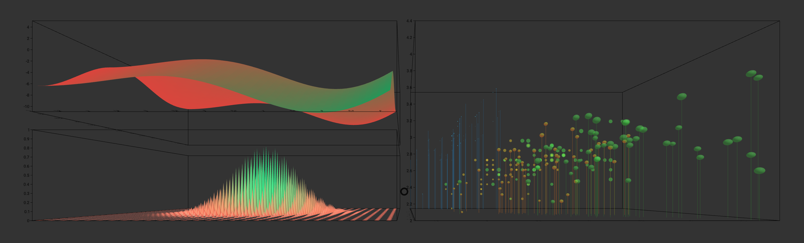

# Getting Started



VR-Viz provide a high-level react components to generate 3D visualization in webVR. It combines A-Frame with React (for DOM manipulation) and D3 (for data visualizations) to generate visualization in VR. It provides a JSON syntax for generating visualizations (the concept is inspired from Vega-Lite)

The react component used to generate visualizations is `Visualization` with 2 props:
* __scene__
* __graph__

__scene__ defines the property of the A-Frame scene that will be generated in which the visualization will be placed. This is not a mandatory prop in the component. If the developers feels the need to design the scene before and then place the visualization in the designed scene he/she can do that. This provide flexibility to design a customized scene with textures and objects in it and also let the developers add other A-Frame component (to add interactivity or animation) to scene.

__graph__ is the prop where the visualization is defined. Different visualization requires the developer to define different parameter. This is a mandatory prop in the component. The prop must be defined as an array which gives flexibility to add multiple visualizations in the same scene to either design a dashboard in VR (just by changing the position of their origin) or overlap multiple visualization on each other.

## Example of Visualization Component
```
<Visualization
  scene={
    {
      'sky': {
        'style': {
          'color': '#ccc',
          'texture': false,
        }
      },
      'lights': [
        {
          'type': 'directional',
          'color': '#fff',
          'position': '0 1 1',
          'intensity': 1,
          "decay": 1,
        },
        {
          'type': 'ambient',
          'color': '#fff',
          'intensity': 1,
          "decay": 1,
        }
      ],
      'camera': {
        'position': '0 0 10',
        'rotation': '0 0 0',
      },
      'floor': {
        'style': {
          'color': '#ccc',
          'texture': false,
          'width': 100,
          'depth': 100,
        }
      }
    }
  }
  graph={
    [
      {
        'type': 'TreeMap',
        'data': {
          'dataFile': "data/TreeMap.json",
          'fileType': 'json',
        },
        'style': {
          'origin': [0, 0, 0],
          'dimensions': {
            'width': 50,
            'depth': 50,
            'height': 5,
          }
        },
        'mark': {
          'type': box,
          'style': {
            'paddingInner': 0.5,
            'paddingOuter': 0.1,
            'extrusion': {
              'field': 'size',
              'startFromZero': true,
            },
            'fill': {
              'scaleType': 'ordinal',
              'opacity': 1,
            },
          },
        },
      }
    ]
  }
/>
```

### Scene Object
Scene object help the developer to define the characteristics of the scene where the visualization will be placed. As mentioned above the scene object is not mandatory. Different keys in this object help us to define the scene.

__Example__
```
{
  'sky': {
    'style': {
      'color': '#ccc',
      'texture': false,
    }
  },
  'lights': [
    {
      'type': 'directional',
      'color': '#fff',
      'position': '0 1 1',
      'intensity': 1,
      "decay": 1,
    },
    {
      'type': 'ambient',
      'color': '#fff',
      'intensity': 1,
      "decay": 1,
    }
  ],
  'camera': {
    'position': '0 0 10',
    'rotation': '0 0 0',
  },
  'floor': {
    'style': {
      'color': '#ccc',
      'texture': false,
      'width': 100,
      'depth': 100,
    }
  }
}
```

5 main features / properties of the scene objects are:
* sky
* lights
* camera
* floor
* 3D-objects

#### sky
Sky has property called `style` in which the visual properties of sky is defined.

__Style Properties for Sky__

Property|Type|Description
---|---|---
color|string|Color of the skybox. __Not Required if `texture` is true.__
texture|bool|If there is texture present in the skybox or not. __Default value is false.__
img|string|Path to the texture / image that is shown on the skybox. __Not required if `texture` is false.__ 

#### lights
Light property is defined as array which can have multiple lights. Proposed light system is a combination of an ambient light source and directional light source. Each element of array i.e. light is defined using the properties mentioned below.

__Properties for Light__

Property|Type|Description
----|----|----
type|string|Type of light. __Required. Available values: `ambient`, `directional`, `point`.__
color|string|Color of the light. __Required__
intensity|float|Intesity of the light. __Required__ 
decay|float|Decay value of the light. __Required__
position|string|Position of light source. __Not required if `type` is ambient. Format is "0 0 0".__ Note that for `type` __directional__ only the vector matters i.e. position="-100 100 0" and position="-1 1 0" are the same.

#### camera

__Properties for Camera__

Property|Type|Description
---|---|---
position|string|Position of the camera. __Required. Format is "0 0 0".__
rotation|string|Rotation of the camera. __Required. Format is "90 0 0".__ Note that the values are in degree and the numbers represent ratation along x-axis, y-axis and z-axis respectively.

#### floor
Floor has property called `style` in which the visual properties of floor is defined.

__Style Properties for Floor__

Property|Type|Description
---|---|---
color|string|Color of the floor. __Not Required if `texture` is true.__
width|float|Width of the floor. __Required__
depth|float|Depth of the floor. __Required__
texture|bool|If there is texture present in the floor or not. __Not Required. Default value is false.__
img|string|Path to the texture / image that is shown on the floor. __Not Required if `texture` is false.__ 
repeat|bool|__Not Required if `texture` is false.__ 

#### 3D-Object
3D-Object property is defined as array which can have multiple 3D objects. Each element of array i.e. 3D object is defined using the properties mentioned below.

__Properties for 3D-Object__

Property|Type|Description
---|---|---
objectFile|string|Path of the 3D object. __Required__
id|string|ID of the 3D object which is later used to identify this object. There should not be any space or special character except _ and must not start with a number. __Required__

### Graph Object
Graph object help the developer to  define the visualization. Although Different visualization requires the developer to define different parameter, their are some features which are same for most or all visualization type. This is a mandatory prop in the component. The prop must be defined as an array which gives flexibility to add multiple visualizations in the same scene to either design a dashboard in VR (just by changing the position of their origin) or overlap multiple visualization on each other.

Main features / properties of the scene objects are:
* type
* data
* style
* mark
* axis __Not required for all the types__

#### type
type is used to define what kind of visualization is needed. The availabe values for type are :
* `BarGraph` for 3D Bar Graph
* `StackedBarGraph` for 3D Stacked Bar Graph
* `RectangleChart` for 3D Rectangle Chart
* `ScatterPlot` for 3D Scatter Plot / 3D Bubble Chat
* `ConnectedScatterPlot` for 3D Connected Scatter Plot
* `MeshPlot` for 3D Mesh Plot
* `WaterFallPlot` for Waterfall Plot
* `TimeSeries` for 3D Time Series
* `ContourPlot` for 3D Contour Plot
* `ParametricCurvePlot` for 3D Parametric Curve Plot
* `SurfacePlot` for 3D Surface Plot
* `ParametricSurfacePlot` for 3D Parametric Surface Plot
* `ContourMap` for 3D Contour Map
* `PointCloud` for 3D Point Cloud
* `ForceDirectedGraph` for 3D Force Directed Graph
* `PrismMap` for 3D Prism Map
* `MapBarGraph` for 3D Map Bar Graph
* `MapStackedBarGraph` for 3D Map Stacked Bar Graph
* `FlowMap` for 3D Flow Map
* `TreeMap` for 3D TreeMap
* `SpiralPlot` for 3D Spiral Plot

__Supported Visualizations__
* [3D Bar Graph](/ReadMe/BarGraph.md)
* [3D Stacked Bar Graph](/ReadMe/StackedBarGraph.md)
* [3D Rectangle Chart](/ReadMe/RectangleChart.md)
* [3D Scatter Plot / 3D Bubble Chat](/ReadMe/ScatterPlot.md)
* [3D Connected Scatter Plot](/ReadMe/ConnectedScatterPlot.md)
* [3D Mesh Plot](/ReadMe/MeshPlot.md)
* [Waterfall Plot](/ReadMe/WaterFallPlot.md)
* [3D Time Series](/ReadMe/TimeSeries.md)
* [3D Contour Plot](/ReadMe/ContourPlot.md)
* [3D Parametric Curve Plot](/ReadMe/ParametricCurvePlot.md)
* [3D Surface Plot](/ReadMe/SurfacePlot.md)
* [3D Parametric Surface Plot](/ReadMe/ParametricSurfacePlot.md)
* [3D Contour Map](/ReadMe/ContourMap.md)
* [3D Point Cloud](/ReadMe/PointCloud.md)
* [3D Force Directed Graph](/ReadMe/ForceDirectedGraph.md)
* [3D Prism Map](/ReadMe/PrismMap.md)
* [3D Map Bar Graph](/ReadMe/MapBarChart.md)
* [3D Map Stacked Bar Graph](/ReadMe/MapStackedBarChart.md)
* [3D Flow Map](/ReadMe/FlowMap.md)
* [3D TreeMap](/ReadMe/TreeMap.md)
* [3D Spiral Plot](/ReadMe/SpiralPlot.md)

#### data

__Properties for Data__

Property|Type|Description
---|---|---
dataFile|string|Path to location where the data file is located. __Required for most visualization type except for _curve plot_, _surface plot_, _parametric curve plot_ and _parametric surface plot_.__
fileType|string|Type of value. __Available values: `csv`, `json`, `ply`, `text`. Default value 'csv'.__ `csv` fletype must have header; `text` is used for csv without header.
desc|array|Description of the header. __Required only if the `fileType` is csv.__ _Example: [['Year', 'date','YYYY'], ['Month', 'text'], ['Tornadoes', 'number'], ['Deaths', 'number']]_. If the data type for a particular header is date or time then the format is also required. Available formats can be seen [here](http://momentjs.com/docs/#/parsing/). _Moment.js is used to parse dates and time._

#### style

__Properties for Style__

Property|Type|Description
---|---|---
origin|array of numbers|Defines the position where the origin of the graph is placed. __Required.__ _Example: [0,0,0]_
rotation|string|Defines the rotation of the chart. __Not Required. Default value: '0 0 0'__ _Format example: '-90 0 0'_
dimension|object|Defines the dimension of the graph. Keys in the object are `width`, `depth` and `height`. The value for all these keys are float type. __Required.__

#### mark
`mark` is used to define the style and encoding for graphics in different visualization. Different visualizations have different `mark` properties and key. These are discussed further in the documentation of individual visualization.

#### axis
`axis` is used to define and draw the x, y and z axis. This object is not compulsary. If this object is not present none of the axes are drawn. 

__Example__
```
'axis': {
  'axis-box': {
    'color': 'black',
  },
  'x-axis': {
    'orient': 'bottom-back',
    'title': {
      'text': '',
      'fontSize': 10,
      'color': 'black',
      'opacity': 1,
    },
    'ticks': {
      'noOfTicks': 10,
      'size': 0.1,
      'color': 'black',
      'opacity': 1,
      'fontSize': 10,
      'rotation': '-90 0 0',
      'align':'center'
    },
    'grid': {
      'color': 'black',
      'opacity': 1,
    }
  },
  'y-axis': {
    'orient': 'bottom-back',
    'title': {
      'text': '',
      'fontSize': 10,
      'color': 'black',
      'opacity': 1,
    },
    'ticks': {
      'noOfTicks': 10,
      'size': 0.1,
      'color': 'black',
      'opacity': 1,
      'fontSize': 10,
      'rotation': '-90 0 0',
      'align':'center'
    },
    'grid': {
      'color': 'black',
      'opacity': 1,
    }
  },
  'z-axis': {
    'orient': 'bottom-back',
    'title': {
      'text': '',
      'fontSize': 10,
      'color': 'black',
      'opacity': 1,
    },
    'ticks': {
      'noOfTicks': 10,
      'size': 0.1,
      'color': 'black',
      'opacity': 1,
      'fontSize': 10,
      'rotation': '-90 0 0',
      'align':'center'
    },
    'grid': {
      'color': 'black',
      'opacity': 1,
    }
  }
}
```

`axis` has the 2 main type of objects
* axis-box
* x-axis, y-axis, z-axis

Note: For __spiral chart__ the `axis` prop is not defined like below. To see the `axis` prop in spiral chart read the documentation of spiral chart [here](/ReadMe/SpiralPlot.md).

__axis-box__
Defines if the axis-box is drawn or not and the color and opacity of the axis box. __Not Required. If the object is not present then the axis-box is not drawn.__ The dimensions of the axis box is taken from the `dimension` object in `style`

__Properties for axis-box__

Property|Type|Description
---|---|---
color|string|Defines the color of the axis box. __Required__
opacity|float|Defines the opacity of the axis box. __Reqruied__. _Value must be between 0 and 1_

__x-axis, y-axis, z-axis__
Defines if the different axes are drawn or not. __Not Required. If an object is not present then that axis is not drawn.__

__Properties for x-axis, y-axis, z-axis__

Property|Type|Description
---|---|---
orient|string|Defines where the ticks are displayed. __Not Required. Default value for x-axis: front-top. Default value for x-axis: front-left. Default value for x-axis: bottom-left.__. _Available values for x-axis: front-top, back-bottom, back-top or front-bottom. Available values for y-axis: front-left, back-left, front-right or back-right. Available values for z-axis: bottom-left, top-left, top-right or bottom-right._
title|object|Defined the style of title for the axis. __Not Required.__ _Currently this feature is not available._
title.text|string|Defined the text for title for the axis. __Required.__ _Currently this feature is not available._
title.fontSize|int|Defined the font size for title for the axis. __Required.__ _Currently this feature is not available._
title.color|string|Defined the color for title for the axis. __Required.__ _Currently this feature is not available._
title.opacity|float|Defined the opacity for title for the axis. __Required.__ _Value must be between 0 and 1. Currently this feature is not available._
tick|object|Defined the ticks for the axis. __Required.__
tick.noOfTicks|int|Defined the no. of tick for the axis. __Required.__ _No. of ticks are only applicable for `linear` scale._
tick.size|float|Defined the font size for ticks for the axis. __Required.__ 
tick.fontSize|int|Defined the font size for text for tick for the axis. __Required.__ 
tick.color|string|Defined the color for ticks and text for tick for the axis. __Required.__ 
tick.opacity|float|Defined the opacity for title for the axis. __Required.__ _Value must be between 0 and 1._
tick.rotation|string| Defines the alignment of the text for ticks. __Not Required. Default value for x-axis: "-90 0 0". Default value for y-axis: "0 0 0". Default value for z-axis: "-90 0 0". Format is "0 0 0"__.
tick.align|string| Defines the alignment of the text for ticks. __Not Required. Default value for x-axis: center. Default value for y-axis: right. Default value for z-axis: right.__. _Available values: left, center, right._
grid|object|Defined the style of grid for the axis. __Not Required.__ _Currently this feature is not available._
grid.color|string|Defined the color for grid for the axis. __Required.__ _Currently this feature is not available._
grid.opacity|float|Defined the opacity for grid for the axis. __Required.__ _Value must be between 0 and 1. Currently this feature is not available._


## To Do

* Add Legends
* Add interactivity using [A-Frame Super Hand Controls](https://github.com/wmurphyrd/aframe-super-hands-component)
* Add collaboration using [A-Frame Networked](https://haydenlee.io/networked-aframe/)

## Installation

This project was bootstrapped with [Create React App](https://github.com/facebookincubator/create-react-app).

This project uses yarn. Install it as described here [https://yarnpkg.com/lang/en/](https://yarnpkg.com/lang/en/) if you haven't already.

To install this project, simply clone the repo and run yarn

## Local Development
In the project directory, you can run:
```
yarn start
```
Runs the app in the development mode.

## Known Issues
* Grid in the axes doesnt work right now
* Titles of the axes doesnt work right now
