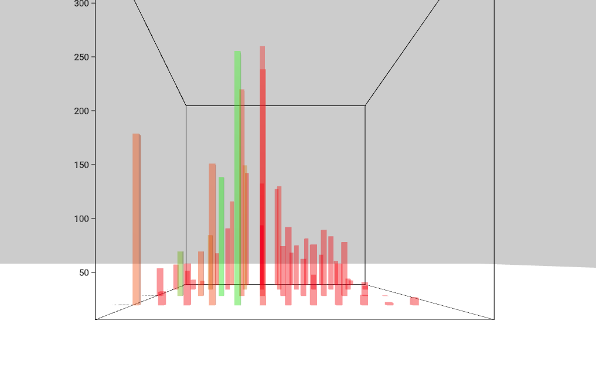

# Bargraph Component



## `mark` Object in Graph Props
```
'mark': {
  'type': 'box',
  'position': {
    'x': {
      'scaleType': 'ordinal',
      'field': 'Month',
      'domain': ['January', 'February', 'March', 'April', 'May', 'June', 'July', 'August', 'September', 'October', 'November', 'December'],
    },
    'z': {
      'scaleType': 'ordinal',
      'field': 'Year',
    }
  },
  'style': {
    'depth': 0.2,
    'width': 0.2,
    'height': {
      'scaleType': 'linear',
      'startFromZero': true,
      'field': 'Tornadoes',
    },
    'fill': {
      'opacity': 0.4,
      'scaleType': 'linear',
      'field': 'Deaths',
      'color': ['red', 'green'],
    },
  }
}
```

__Properties for `mark` for Bar Graph__

Property|Type|Description
---|---|---
type|string|Defines type of bar that would be created. __Not Required. Default value: box__. _Available values: box, cone or cylinder._
position|object|Defines the how the position of bars will be mapped. __Required.__
position.x|object|__Required.__
position.x.scaleType|int|Defines the scale type for x position of the bar. __Required.__ _Available values: linear or ordinal._
position.x.field|string|Defines the field in the data that will be mapped as x position of the bar. __Required.__
position.x.domain|float|Defines the domain for x position. __Not Required.__ _If not present the domain is calculated from the provide data depending on the position.x.scaleType._
position.x.startFromZero|boolean|Defines if the domain starts from 0 or not. __Not Required. Default value: false__ _Only applicable if position.x.domain is not given and position.x.scaleType is `linear`._
position.z|object|__Required.__
position.z.scaleType|string|Defines the scale type for z position of the bar. __Required.__ _Available values: linear or ordinal._
position.z.field|string|Defines the field in the data that will be mapped as z position of the bar. __Required.__
position.z.domain|array|Defines the domain for z position. __Not Required.__ _If not present the domain is calculated from the provide data depending on the position.z.scaleType._
position.z.startFromZero|boolean|Defines if the domain starts from 0 or not. __Not Required. Default value: false__ _Only applicable if position.x.domain is not given and position.z.scaleType is `linear`._
style|object|Defines the style for the bar. __Required.__
style.width|float|Defines the width of the bar. __Required if `type` is `box`.__ 
style.depth|float|Defines the depth of the bar.  __Required if `type` is `box`.__ 
style.bottomRadius|float|Defines the bottom radius of the bar, if the bar is a cone. __Required if `type` is `cone`.__ 
style.topRadius|float|Defines the top radius of the bar, if the bar is a cone. __Required if `type` is `cone`.__ 
style.radius|float|Defines the radius of the bar, if the bar is a cylinder. __Required if `type` is `cylinder`.__ 
style.segments|int|Defines the no. of segments in bar, if the bar is a cylinder or cone. __Required if `type` is `cylinder` or `cone`.__ 
style.height|object|Defines the height of the bar. __Required.__
style.height.scaleType|string|Defines the scale type for height of the bar. __Required.__ _Available values: linear or ordinal._
style.height.field|string|Defines the field in the data that will be mapped as height of the bar. __Required.__
style.height.domain|array|Defines the domain for height. __Not Required.__ _If not present the domain is calculated from the provide data depending on the style.height.scaleType_
style.height.startFromZero|boolean|Defines if the domain starts from 0 or not. __Not Required. Default value: false__ _Only applicable if style.height.domain is not given and style.height.scaleType is `linear`._
style.fill|object|Defines the fill of the bar. __Required.__
style.fill.opacity|float|Defines the opacity of the bar. __Required.__ _Value must be between 0 and 1._
style.fill.scaleType|string|Defines the scale type for fill of the bar. __Not Required. If not present then a constant color that is defined is filled in the bar.__ _Available values: linear or ordinal._
style.fill.field|string|Defines the field in the data that will be mapped as fill of the bar. __Required if `style.fill.scaleType` is present.__
style.fill.domain|array|Defines the domain for fill. __Not Required.__ _If not present the domain is calculated from the provide data depending on the style.fill.scaleType_
style.fill.color|array or string|Defines the color for fill. __Not Required if style.fill.scaleType is present, else required. Default value: d3.schemeCategory10__ _If style.fill.scaleType is not present the this needs to be a string otherwise an array._
style.fill.startFromZero|boolean|Defines if the domain starts from 0 or not. __Not Required. Default value: false__ _Only applicable if style.fill.color is not given and style.fill.scaleType is `linear`._

## The Data

**Datafile**: `csv`

```
Year,Month,Tornadoes,Deaths
1996,January,35,1
1996,February,14,1
1997,January,50,2
1997,February,23,1
1998,January,47,0
1998,February,72,42
1999,January,212,18
1999,February,22,0
```

#### [Example](../examples/Bargraph.js)