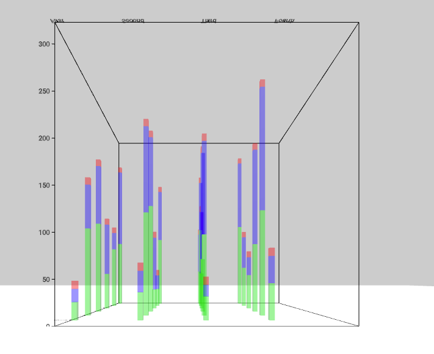

# StackedBargraph Component



## `mark` Object in Graph Props

```
'mark': {
  'position': {
    'x': {
      'scaleType': 'ordinal',
      'field': 'Quarters',
    },
    'z': {
      'scaleType': 'ordinal',
      'field': 'Countries',
    }
  },
  'type': 'box',
  'style': {
    'padding': {
      'x': 0.1,
      'z': 0.1,
    },
    'height': {
      'scaleType': 'linear',
      'field': ['Cars', 'Trucks', 'Bikes'],
      'startFromZero': true,
    },
    'fill': {
      'scaleType': 'ordinal',
      'opacity': 0.4,
      'color': ['green', 'blue', 'red'],
      'field': ['Cars', 'Trucks', 'Bikes'],
    },
  }
}
```

**Properties for `mark` for Stacked Bar Graph**

| Property                           | Type            | Description                                                                                                                                                                                                                   |
| ---------------------------------- | --------------- | ----------------------------------------------------------------------------------------------------------------------------------------------------------------------------------------------------------------------------- |
| type                               | string          | Defines type of bar that would be created. **Not Required. Default value: box**. _Available values: box, cylinder._                                                                                                           |
| position                           | object          | Defines the how the position of bars will be mapped. **Required**                                                                                                                                                             |
| position.x                         | object          | **Required.**                                                                                                                                                                                                                 |
| position.x.scaleType               | float           | Defines the scale type for x position of the bar. **Required.** _Available values: ordinal._                                                                                                                                  |
| position.x.field                   | string          | Defines the field in the data that will be mapped as x position of the bar. **Required.**                                                                                                                                     |
| position.x.domain                  | float           | Defines the domain for x position. **Not Required.** _If not present the domain is calculated from the provide data depending on the position.x.scaleType._                                                                   |
| position.z                         | object          | **Required.**                                                                                                                                                                                                                 |
| position.z.scaleType               | string          | Defines the scale type for z position of the bar. **Required.** _Available values: ordinal._                                                                                                                                  |
| position.z.field                   | string          | Defines the field in the data that will be mapped as z position of the bar. **Required.**                                                                                                                                     |
| position.z.domain                  | array           | Defines the domain for z position. **Not Required.** _If not present the domain is calculated from the provide data depending on the position.z.scaleType._                                                                   |
| style                              | object          | Defines the style for the bar. **Required.**                                                                                                                                                                                  |
| style.padding                      | object          | Defines the spacing between the bar. **Required.**                                                                                                                                                                            |
| style.padding.x                    | object          | Defines the spacing between the bar along x axis. **Required.** _Value must be between 0 and 1._                                                                                                                              |
| style.padding.z                    | object          | Defines the spacing between the bar along z axis. **Required.** _Value must be between 0 and 1._                                                                                                                              |
| style.segments                     | int             | Defines the no. of segments in bar, if the bar is a cylinder or cone. **Required if `type` is `cylinder`.**                                                                                                                   |
| style.height                       | object          | Defines the height of the bar. **Required.**                                                                                                                                                                                  |
| style.height.scaleType             | string          | Defines the scale type for height of the bar. **Required.** _Available values: linear or ordinal._                                                                                                                            |
| style.height.field                 | string          | Defines the field in the data that will be mapped as height of the bar. **Required.**                                                                                                                                         |
| style.height.domain                | array           | Defines the domain for height. **Not Required.** _If not present the domain is calculated from the provide data depending on the style.height.scaleType_                                                                      |
| style.height.value                 | array           | Defines the range for height. **Required.**                                                                                                                                                                                   |
| style.height.startFromZero         | boolean         | Defines if the domain starts from 0 or not. **Not Required. Default value: false** _Only applicable if style.height.domain is not given and style.height.scaleType is `linear`._                                              |
| style.fill                         | object          | Defines the fill of the bar. **Required.**                                                                                                                                                                                    |
| style.fill.opacity                 | float           | Defines the opacity of the bar. **Required.** _Value must be between 0 and 1._                                                                                                                                                |
| style.fill.scaleType               | string          | Defines the scale type for fill of the bar. **Required.** _Available values: ordinal._                                                                                                                                        |
| style.fill.field                   | array of string | Defines the field in the data that will be mapped as fill of the bar. **Required if `style.fill.scaleType` is present.**                                                                                                      |
| style.fill.color                   | array           | Defines the color for fill. **Not Required if style.fill.scaleType is present, else required. Default value: d3.schemeCategory10** _If style.fill.scaleType is not present the this needs to be a string otherwise an array._ |
| mouseOver                          | Object          | Defines the mouseOver effect on the bars. **Not Required.** _If not present no mouse over effect happens._                                                                                                                    |
| mouseOver.focusedObject            | object          | Defines the style for the mouseOver effect on the bar. **Required.**                                                                                                                                                          |
| mouseOver.focusedObject.opacity    | float           | Defines the opacity of bar when mouse hovers on it. **Required.**                                                                                                                                                             |
| mouseOver.focusedObject.fill       | string          | Defines the color of bar when mouse hovers on it. **Required.**                                                                                                                                                               |
| mouseOver.nonFocusedObject         | object          | Defines the style for the bar not in focus. **Required.**                                                                                                                                                                     |
| mouseOver.nonFocusedObject.opacity | float           | Defines the opacity of bar which are not in focus when mouse hovers on a particular bar. **Required.**                                                                                                                        |
| mouseOver.label                    | object          | Defines the value and style of the mouse over text. **Not Required.** _If not present the label is not shown._                                                                                                                |
| mouseOver.label.value              | function        | Returns the value of the text that is to be shown in the label. **Required.** _\n can be used for new line._                                                                                                                  |
| mouseOver.label.align              | string          | Defines the alignment of the text in the label. **Required.** _Available values: center, left or right._                                                                                                                      |
| mouseOver.label.fontColor          | string          | Defines the color of the text in the label. **Required.**                                                                                                                                                                     |
| mouseOver.label.lineHeight         | float           | Defines the line height of the text in the label. **Not Required.**                                                                                                                                                           |
| mouseOver.label.wrapCount          | int             | Defines the wrap count of the text in the label. **Not Required.**                                                                                                                                                            |
| mouseOver.label.backgroundColor    | string          | Defines the color of the background of the label. **Required.**                                                                                                                                                               |
| mouseOver.label.backgroundOpacity  | string          | Defines the color of the background of the label. **Required.**                                                                                                                                                               |
| mouseOver.label.position           | string          | Defines the position of the label w.r.t the cursor. **Not Required. Format is "0 0 0".**                                                                                                                                      |
| mouseOver.label.rotation           | string          | Defines the rotation of the label w.r.t the cursor. **Not Required. Format is "90 0 0".**                                                                                                                                     |
| mouseOver.label.width              | float           | Defines the width of the label. **Not Required.**                                                                                                                                                                             |
| mouseOver.label.height             | float           | Defines the height of the label. **Not Required.**                                                                                                                                                                            |

_Note: The width and depth or radius of the bar is calculated depending upon the dimensions of the graph and padding in between the bars._

### [Example JS of the Visualization](../examples/Charts/StackedBargraph.js)

## Data

**Datafile**: `csv`

```
Countries,Quarters,Cars,Trucks,Bikes
USA,First,119,143,10
Canada,First,104,30,10
Europe,First,58,83,10
Mexico,First,134,88,10
Asia,First,119,60,10
Africa,First,22,16,10
USA,Second,127,96,10
Canada,Second,31,25,10
Europe,Second,32,87,10
Mexico,Second,161,105,10
Asia,Second,141,118,10
Africa,Second,34,26,10
USA,Third,64,74,10
Canada,Third,139,87,10
Europe,Third,59,103,10
Mexico,Third,80,162,10
Asia,Third,111,128,10
Africa,Third,29,14,10
USA,Fourth,153,127,10
Canada,Fourth,70,56,10
Europe,Fourth,56,30,10
Mexico,Fourth,103,144,10
Asia,Fourth,144,169,10
Africa,Fourth,45,33,10
```
