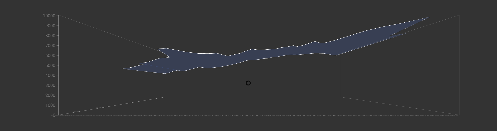

# TimeSeries Component



## `mark` Object in Graph Props

```
'mark': {
  'type': 'plane',
  'position': {
    'x': {
      'scaleType': 'ordinal',
      'field': 'Year',
    },
    'y': {
      'scaleType': 'linear',
      'field': 'Tornadoes',
    },
    'z': {
      'scaleType': 'linear',
      'field': 'Deaths',
    }
  },
  'style': {
    'fill': {
      'color': 'red',
      'opacity': 0.4,
    },
    'stroke': {
      'width': 1,
      'color': 'black',
    },
  }
}
```

**Properties for `mark` for Parametric Time Series**

| Property                 | Type    | Description                                                                                                                                                                       |
| ------------------------ | ------- | --------------------------------------------------------------------------------------------------------------------------------------------------------------------------------- |
| type                     | string  | Defines type of contour that would be created. **Required. Default value: plane**. _Available values: plane._                                                                     |
| position                 | object  | Defines the how the position of vertices for contour will be mapped. **Required**                                                                                                 |
| position.x               | object  | **Required.**                                                                                                                                                                     |
| position.x.scaleType     | string  | Defines the scale type for x position of the points on the timeseries. **Required.** _Available values: linear or ordinal._                                                       |
| position.x.field         | string  | Defines the field in the data that will be mapped as x position of the points on the timeseries. **Required.**                                                                    |
| position.x.domain        | float   | Defines the domain for x position. **Not Required.** _If not present the domain is calculated from the provide data depending on the position.x.scaleType._                       |
| position.x.startFromZero | boolean | Defines if the domain starts from 0 or not. **Not Required. Default value: false** _Only applicable if position.x.domain is not given and position.x.scaleType is `linear`._      |
| position.y               | object  | **Required.**                                                                                                                                                                     |
| position.y.scaleType     | string  | Defines the scale type for y position of the points on the timeseries. **Required.** _Available values: linear or ordinal._                                                       |
| position.y.field         | string  | Defines the field in the data that will be mapped as y position of the points on the timeseries. **Required.**                                                                    |
| position.y.domain        | float   | Defines the domain for y position. **Not Required.** _If not present the domain is calculated from the provide data depending on the position.y.scaleType._                       |
| position.y.startFromZero | boolean | Defines if the domain starts from 0 or not. **Not Required. Default value: false** _Only applicable if position.y.domain is not given and position.y.scaleType is `linear`._      |
| position.z               | object  | **Required.**                                                                                                                                                                     |
| position.z.scaleType     | string  | Defines the scale type for z position of the points on the timeseries. **Required.** _Available values: linear or ordinal._                                                       |
| position.z.field         | string  | Defines the field in the data that will be mapped as z position of the points on the timeseries. **Required.**                                                                    |
| position.z.domain        | float   | Defines the domain for z position. **Not Required.** _If not present the domain is calculated from the provide data depending on the position.z.scaleType._                       |
| position.z.startFromZero | boolean | Defines if the domain starts from 0 or not. **Not Required. Default value: false** _Only applicable if position.z.domain is not given and position.z.scaleType is `linear`._      |
| style                    | object  | Defines the style of the contour. **Required**                                                                                                                                    |
| style.fill               | object  | Defines the fill of the surface. **Required.**                                                                                                                                    |
| style.fill.opacity       | float   | Defines the opacity of the surface. **Required.** _Value must be between 0 and 1._                                                                                                |
| style.fill.color         | string  | Defines the color for fill. **Required.**                                                                                                                                         |
| style.stroke             | object  | Defines the stroke for the timeseries. **Not Required. If not present the timeseries are not stroked.** _This can be used to design a mesh to make the timeseries more readable._ |
| style.stroke.width       | float   | Defines the stroke of the timeseries. **Required.**                                                                                                                               |
| style.stroke.color       | string  | Defines the stroke color for the timeseries. **Required.**                                                                                                                        |

### [Example JS of the Visualization](../examples/Charts/TimeSeries.js)

## Data

**Datafile**: `csv`

```
Year,Tornadoes,Deaths
1996,35,1
1997,14,1
1998,71,0
```
