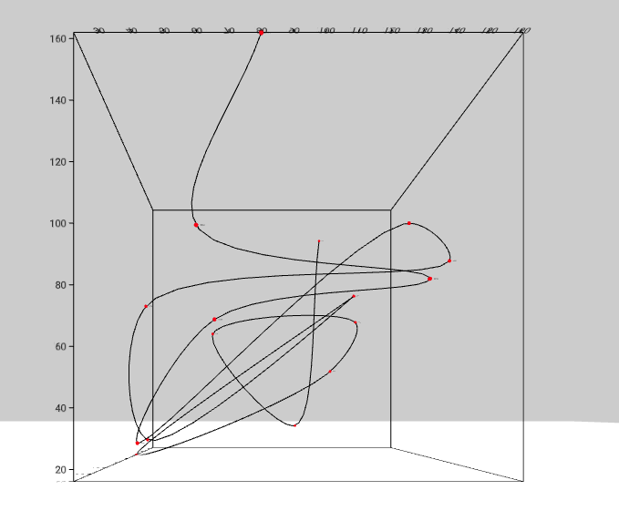

# ConnectedScatterPlot Component



## `mark` Object in Graph Props
```
'mark': {
  'position': {
    'x': {
      'scaleType': 'linear',
      'field': 'Cars',
    },
    'y': {
      'scaleType': 'linear',
      'field': 'Trucks',
    },
    'z': {
      'scaleType': 'linear',
      'field': 'Bikes',
    }
  },
  'points': {
    'type': 'sphere',
    'style': {
      'radius': {
        'value': 0.05,
      },
      'fill': {
        'opacity': 1,
        'color': 'red',
      },
    },
  },
  'line': {
    'style': {
      'stroke': {
        'color': 'black',
        'opacity': 1,
      },
    },
  },
  'label': {
    'field': 'Year',
    'style': {
      'color': 'black',
      'fontSize': 2,
      'opacity': 1,
    },
  }
}
```

__Properties for `mark` for Connected Scatter Plot__

Property|Type|Description
---|---|---
type|string|Defines type of point that would be created. __Not Required. Default value: box__. _Available values: box, cone or cylinder._
position|object|Defines the how the position of points will be mapped. __Required__
position.x|object|__Required.__
position.x.scaleType|string|Defines the scale type for x position. __Required.__ _Available values: linear or ordinal._
position.x.field|string|Defines the field in the data that will be mapped as x position. __Required.__
position.x.domain|float|Defines the domain for x position. __Not Required.__ _If not present the domain is calculated from the provide data depending on the position.x.scaleType._
position.x.startFromZero|boolean|Defines if the domain starts from 0 or not. __Not Required. Default value: false__ _Only applicable if position.x.domain is not given and position.x.scaleType is `linear`._
position.y|object|__Required.__
position.y.scaleType|string|Defines the scale type for y position. __Required.__ _Available values: linear or ordinal._
position.y.field|string|Defines the field in the data that will be mapped as y position. __Required.__
position.y.domain|array|Defines the domain for y position. __Not Required.__ _If not present the domain is calculated from the provide data depending on the position.y.scaleType._
position.y.startFromZero|boolean|Defines if the domain starts from 0 or not. __Not Required. Default value: false__ _Only applicable if position.y.domain is not given and position.y.scaleType is `linear`._
position.z|object|__Required.__
position.z.scaleType|string|Defines the scale type for z position. __Required.__ _Available values: linear or ordinal._
position.z.field|string|Defines the field in the data that will be mapped as z position. __Required.__
position.z.domain|array|Defines the domain for z position. __Not Required.__ _If not present the domain is calculated from the provide data depending on the position.z.scaleType._
position.z.startFromZero|boolean|Defines if the domain starts from 0 or not. __Not Required. Default value: false__ _Only applicable if position.z.domain is not given and position.z.scaleType is `linear`._
points|object|Defines the style of the points in connected scatter plot. __Required.__
points.type|string|Defines the type for the point. __Not Required. Default value: sphere.__ _Available values: box or sphere._
points.style|object|Defines the style of the point. __Required.__ 
points.style.radius|object|Defines the radius of the point. __Required.__ 
points.style.radius.scaleType|string|Defines the scale type for radius of the points. __Not Required. If not present then a constant color that is defined is filled in the points.__ _Available values: linear or ordinal._
points.style.radius.domain|array|Defines the domain for radius. __Not Required.__ _If not present the domain is calculated from the provide data depending on the points.style.radius.scaleType_
points.style.radius.startFromZero|boolean|Defines if the domain starts from 0 or not. __Not Required. Default value: false__ _Only applicable if points.style.radius.color is not given and points.style.radius.scaleType is `linear`._
points.style.radius.value|float or array|Defines the value radius of the point. __Required.__ _Array is required if points.style.radius.scaleType is present else its a float._
points.style.fill|object|Defines the fill of the points. __Required.__
points.style.fill.opacity|float|Defines the opacity of the points. __Required.__ _Value must be between 0 and 1._
points.style.fill.scaleType|string|Defines the scale type for fill of the points. __Not Required. If not present then a constant color that is defined is filled in the points.__ _Available values: linear or ordinal._
points.style.fill.field|string|Defines the field in the data that will be mapped as fill of the points. __Required if `points.style.fill.scaleType` is present.__
points.style.fill.domain|array|Defines the domain for fill. __Not Required.__ _If not present the domain is calculated from the provide data depending on the points.style.fill.scaleType_
points.style.fill.color|array or string|Defines the color for fill. __Not Required if points.style.fill.scaleType is present, else required. Default value: d3.schemeCategory10__ _If points.style.fill.scaleType is not present the this needs to be a string otherwise an array._
points.style.fill.startFromZero|boolean|Defines if the domain starts from 0 or not. __Not Required. Default value: false__ _Only applicable if points.style.fill.color is not given and points.style.fill.scaleType is `linear`._
points.mouseOver|Object|Defines the mouseOver effect on the points. __Not Required.__ _If not present no mouse over effect happens._
points.mouseOver.focusedObject|object|Defines the style for the mouseOver effect on the point. __Required.__
points.mouseOver.focusedObject.opacity|float|Defines the opacity of point when mouse hovers on it. __Required.__
points.mouseOver.focusedObject.fill|string|Defines the color of point when mouse hovers on it. __Required.__
points.mouseOver.nonFocusedObject|object|Defines the style for the point not in focus. __Required.__
points.mouseOver.nonFocusedObject.opacity|float|Defines the opacity of point which are not in focus when mouse hovers on a particular point. __Required.__
points.mouseOver.label|object|Defines the value and style of the mouse over text. __Not Required.__ _If not present the label is not shown._
points.mouseOver.label.value|function|Returns the value of the text that is to be shown in the label. __Required.__ _\n can be used for new line._
points.mouseOver.label.align|string|Defines the alignment of the text in the label. __Required.__ _Available values: center, left or right._
points.mouseOver.label.fontColor|string|Defines the color of the text in the label. __Required.__
points.mouseOver.label.lineHeight|float|Defines the line height of the text in the label. __Not Required.__
points.mouseOver.label.wrapCount|int|Defines the wrap count of the text in the label. __Not Required.__
points.mouseOver.label.backgroundColor|string|Defines the color of the background of the label. __Required.__
points.mouseOver.label.backgroundOpacity|string|Defines the color of the background of the label. __Required.__
points.mouseOver.label.position|string|Defines the position of the label w.r.t the cursor. __Not Required. Format is "0 0 0".__
points.mouseOver.label.rotation|string|Defines the rotation of the label w.r.t the cursor. __Not Required. Format is "90 0 0".__
points.mouseOver.label.width|float|Defines the width of the label. __Not Required.__
points.mouseOver.label.height|float|Defines the height of the label. __Not Required.__
line|object|Defines the style of the connecting line in connected scatter plot. __Required.__
line.style|object|Defines the style of the line. __Required.__ 
line.style.stroke.color|string|Defines the color for line. __Required.__
line.style.stroke.opacity|float|Defines the opacity for line. __Required.__ _Value must be between 0 and 1._
label|object|Defines the style of the connecting line in connected scatter plot. __Not Required.__ _If not present the labels are not shown close to the point._
label.field|string|Defines the field in the data that will be used as the text for the labels. __Required.__
label.style|object|Defines the style of the label. __Required.__
label.style.color|string|Defines the color for label. __Required.__
label.style.opacity|float|Defines the opacity for label. __Required.__ _Value must be between 0 and 1._
label.style.fontSize|float|Defines the size of label. __Required.__

### [Example JS of the Visualization](../examples/ConnectedScatterPlot.js)

#### Data

**Datafile**: `csv`

In connected scatterplot the order of the dataset is considered as the order in which the connected scatterplot is plotted.

```
Year,Cars,Trucks,Bikes
1990,119,143,1
1991,104,30,2
1992,58,83,3
1993,134,88,4
1994,119,60,5
```
