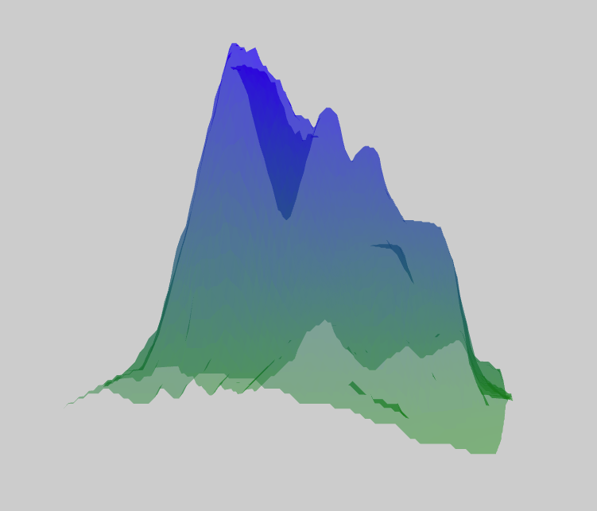

# ContourMap Component



## `mark` Object in Graph Props
```
'mark': {
  'type': 'plane',
  'heightThreshold': 100,
  'style': {
    'fill': {
      'scaleType': 'linear',
      'opacity': 0.4,
      'color': ['green', 'blue'],
    },
    'stroke': {
      'width': 1,
      'color': 'black',
    }
  },
}
```

__Properties for `mark` for Contour Map__

Property|Type|Description
---|---|---
type|string|Defines type of plane that would be created. __Required.__ _Available values: plane._
heightThreshold|float|Defines what height will be mapped to 0. __Not Required. Default value: 0.__
style|object|Defines the style for the planes. __Required.__
style.fill|object|Defines the fill for the planes. __Not Required. If not present the planes are not filled.__
style.fill.opacity|float|Defines the opacity of the planes. __Required.__ _Value must be between 0 and 1._
style.fill.scaleType|string|Defines the scale type for fill of the planes. __Not Required. If not present then a constant color that is defined is filled in the planes.__ _Available values: linear._
style.fill.color|array or string|Defines the color for fill. __Required__ _If style.fill.scaleType is not present the this needs to be a string otherwise an array._
style.stroke|object|Defines the stroke for the planes. __Not Required. If not present the planes are not stroked.__
style.stroke.width|float|Defines the stroke of the planes. __Required.__
style.stroke.color|string|Defines the stroke color for plane. __Required.__

### [Example JS of the Visualization](../examples/ContourMap.js)

## Data

**Datafile**: `text`

The data file is without header. Rows corresponding to grid lines running east to west and columns to grid lines running south to north.

```
100,100,101,101,101
101,101,102,102,102
102,102,103,103,103
102,102,103,103,103
102,102,103,103,103
```


