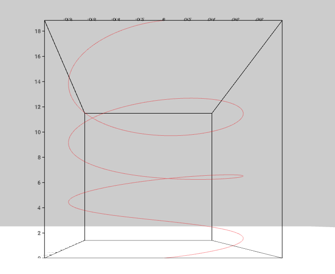

# ContourPlot Component



## `mark` Object in Graph Props
```

'mark': {
  'type': 'line',
  'position': {
    'x': {
      'scaleType': 'linear',
      'function': (y) => Math.sin(y),
    },
    'y': {
      'scaleType': 'linear',
      'domain': [0, 6 * Math.PI],
      'steps': 150,
    },
    'z': {
      'scaleType': 'linear',
      'function': (y) => Math.cos(y),
    }
  },
  'style': {
    'opacity': 1,
    'color': 'red',
  }
},
```

__Properties for `mark` for Contour Plot__

Property|Type|Description
---|---|---
type|string|Defines type of contour that would be created. __Required. Default value: line__. _Available values: line._
position|object|Defines the how the position of vertices for contour will be mapped. __Required__
position.x|object|__Required.__
position.x.scaleType|string|Defines the scale type for x position. __Required.__ _Available values: linear._
position.x.domain|array|Defines the domain for x position. __Not Required.__ _If not present the domain is calculated from the provide data depending on the position.x.scaleType._
position.x.function|function|Defines the function for x position. __Required.__
position.y|object|__Required.__
position.y.scaleType|string|Defines the scale type for y position. __Required.__ _Available values: linear._
position.y.domain|array|Defines the domain for which the contour is plot. __Required.__
position.y.steps|array|Defines the intervals at which the curve is calculated. __Required.__
position.z|object|__Required.__
position.z.scaleType|string|Defines the scale type for z position. __Required.__ _Available values: linear._
position.z.domain|array|Defines the domain for z position. __Not Required.__ _If not present the domain is calculated from the provide data depending on the position.z.scaleType._
position.z.function|function|Defines the function for z position. __Required.__
style|object|Defines the style of the contour. __Required__
style.opacity|float|Defines the opacity of the contour. __Required.__ _Value must be between 0 and 1._
style.curveType|string|Defines the type of curver for line. Available vaules: `line` for straight line, `CatmullRomCurve` for curve and `lineSegment` for discontinuos line segments.  __Not Required.__ _Default Value: `line`_
style.resolution|number|Defines how edgy the curve for the flow is. __Not Required. Default value: 20__ _Smaller number is recommended for better performance. Only applicable if `style.curveType` is `CatmullRomCurve`_
style.color|string|Defines the color for contour. __Required.__

### [Example JS of the Visualization](../examples/ContourPlot.js)
