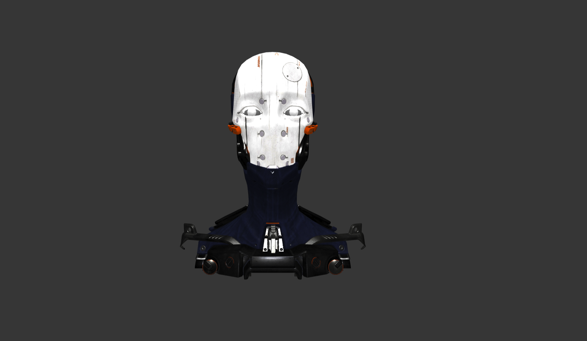

# CrossSectionView Component



## Object in Graph Props
```
'mark':{
  'material':{
    'type':'phong',
    'fill': {
      'opacity': 0.4,
      'color': '#ff0000',
      'shininess':30,
      'emissive':'#000000',
      'specular':'#ffffff',
    },
    'stroke': {
      'width': 1,
      'color': '#ffff00',
      'edgeThresholdAngle':50
    },
    'emphasisMaterial':{
      'opacity': 0.8,
      'color': '#ffff00',
      'meshes':['Adam','Eyelid'],
    },
    'highlightOnClick':{
      'opacity': 0.8,
      'color': '#ff0000',
    }
  },
  'object':'data/Duck.gltf'
}
```

__Properties for `mark` for Cross Section View__

Property|Type|Description
---|---|---
object|string|Defines link to the gltf file. __Required__
material|object|Defines the material to be shown on the 3D model. __Required__
material.type|string|Defines the type of material that used on the meshes of the model. If type is not mentioned than the material from the gltf file is used. __Not Required.__ _Available values: normal, lambert or phong._
material.fill|object| __Required if `material.type` is present.__
material.fill.color|string|Defines color of the meshes. __Not Required. Default value: #ff0000__ _Only applicable if material.type is lambert or phong_
material.fill.opacity|number|Defines opacity of the meshes. __Not Required. Default value: 1__
material.fill.shininess|number|Defines shininess of the meshes. __Not Required. Default value: 30__ _Only applicable if material.type is phong_
material.fill.emmisive|string|Defines emmisive color of the meshes. __Not Required. Default value: #000000__ _Only applicable if material.type is phong_
material.fill.specular|string|Defines specular of the meshes. __Not Required. Default value: #ffffff__ _Only applicable if material.type is phong_
material.stroke|object| Defines the stroke setting for the meshes __Not Required.__ _If not present stroke will not be shown._
material.stroke.width|number| Defines the stroke width for the meshes __Not Required. Default value: 1__
material.stroke.color|string| Defines the stroke color for the meshes __Not Required. Default value: #000000__
material.stroke.edgeThresholdAngle|number| An edge is only rendered if the angle (in degrees) between the face normals of the adjoining faces exceeds this value __Not Required. Default value: 20__
material.emphasisMaterial|object| Defines the emphasis setting for the meshes. This is used to highlight certain part of the model. __Not Required.__
material.emphasisMaterial.opacity|number| Defines the opacity for the meshes which are emphasized __Not Required. Default value: 1__
material.emphasisMaterial.color|string| Defines the color for the meshes which are emphasized __Not Required. Default value: #ffff00__ _Only applicable if material.type is lambert or phong_
material.emphasisMaterial.meshes|array of string| Defines the names of all the meshes that need to be emphasized. It also emphasizes the meshes whose names containes a substring defined here. _For example if the array is `['box']` it will emphasize all the meshes named box and all the meshes whose name contains box like `box-1`, `box-2` etc._ __Required__
material.highlightOnClick|object| Defines the display setting for the meshes when it is clicked __Not Required.__
material.highlightOnClick.opacity|number| Defines the opacity for the meshes when it is clicked __Not Required. Default value: 1__
material.highlightOnClick.color|string| Defines the color for the meshes when it is clicked __Not Required. Default value: #ffff00__ _Only applicable if material.type is lambert or phong_

### [Example JS of the Visualization](../examples/CrossSectionView.js)

#### Data

**Datafile**: `gltf`
