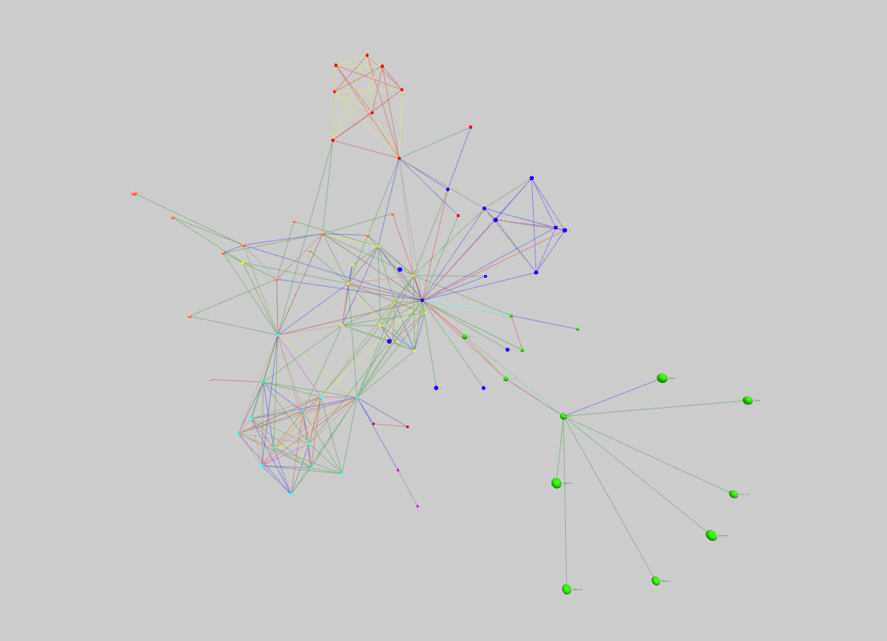

# ForceDirectedGraph Component



## `mark` Object in Graph Props
```
'mark': {
  'nodes': {
    'type': 'sphere',
    'style': {
      'radius': {
        'value': 0.1,
      },
      'fill': {
        'scaleType': 'ordinal',
        'opacity': 1,
        'field': 'group',
        'color': ['green', 'blue', 'red', 'yellow', 'tomato', 'olive', 'magenta', 'cyan', 'gray', 'maroon'],
        'domain': [1, 2, 3, 4, 5, 6, 7, 8, 9, 10],
      },
    },
  },
  'links': {
    'type': 'line',
    'style': {
      'fill': {
        'scaleType': 'ordinal',
        'opacity': {
          'value': 0.3,
        },
        'field': 'value',
        'color': ['green', 'blue', 'red', 'yellow', 'tomato', 'olive', 'magenta', 'cyan', 'gray', 'maroon'],
        'domain': [1, 2, 3, 4, 5, 6, 7, 8, 9, 10],
      },
    },
  },
  'labels': {
    'field': 'id',
    'style': {
      'color': 'black',
      'opacity': 1,
      'fontSize': 1,
      'padding': 0.1,
    }
  },
}
```

__Properties for `mark` for Connected Scatter Plot__

Property|Type|Description
---|---|---
nodes|object|Defines the style and shape of the noda. __Required.__
nodes.type|string|Defines type of nodes that would be created. __Not Required. Default value: sphere__. _Available values: sphere, box._
nodes.style|object|Defines the style of the node. __Required.__
nodes.style.fill|object|Defines the fill of the node. __Required.__
nodes.style.fill.opacity|float|Defines the opacity of the node. __Required.__ _Value must be between 0 and 1._
nodes.style.fill.scaleType|string|Defines the scale type for fill of the node. __Not Required. If not present then a constant color that is defined is filled in the node.__ _Available values: linear or ordinal._
nodes.style.fill.field|string|Defines the field in the data that will be mapped as fill of the node. __Required if `nodes.style.fill.scaleType` is present.__
nodes.style.fill.domain|array|Defines the domain for fill. __Not Required.__ _If not present the domain is calculated from the provide data depending on the nodes.style.fill.scaleType_
nodes.style.fill.color|array or string|Defines the color for fill. __Not Required if nodes.style.fill.scaleType is present, else required. Default value: d3.schemeCategory10__ _If nodes.style.fill.scaleType is not present the this needs to be a string otherwise an array._
nodes.style.fill.startFromZero|boolean|Defines if the domain starts from 0 or not. __Not Required. Default value: false__ _Only applicable if nodes.style.fill.color is not given and nodes.style.fill.scaleType is `linear`._
nodes.style.radius|object|Defines the radius of the points. __Required.__
nodes.style.radius.scaleType|string|Defines the scale type for radius of the points. __Not Required. If not present then a constant radius that is defined is used.__ _Available values: linear or ordinal._
nodes.style.radius.field|string|Defines the field in the data that will be mapped as radius of the points. __Required if `nodes.style.radius.scaleType` is present.__
nodes.style.radius.domain|array|Defines the domain for radius. __Not Required.__ _If not present the domain is calculated from the provide data depending on the nodes.style.radius.scaleType_
nodes.style.radius.value|array of float or float|Defines the range for radius. __Required.__ _If `nodes.style.radius.scaleType` is not present the `nodes.style.radius.value` is float or else its an array of float._
nodes.style.radius.startFromZero|boolean|Defines if the domain starts from 0 or not. __Not Required. Default value: false__ _Only applicable if nodes.style.radius.domain is not given and nodes.style.radius.scaleType is `linear`._
links|object|Defines the style and shape of the link. __Required.__
links.type|string|Defines type of nodes that would be created. __Not Required. Default value: line__. _Available values: line._
links.style|object|Defines the style of the link. __Required.__
links.style.fill|object|Defines the fill of the link. __Required.__
links.style.fill.scaleType|string|Defines the scale type for fill of the link. __Not Required. If not present then a constant color that is defined is filled in the link.__ _Available values: linear or ordinal._
links.style.fill.field|string|Defines the field in the data that will be mapped as fill of the link. __Required if `links.style.fill.scaleType` is present.__
links.style.fill.domain|array|Defines the domain for fill. __Not Required.__ _If not present the domain is calculated from the provide data depending on the links.style.fill.scaleType_
links.style.fill.color|array of string or string|Defines the color for fill. __Not Required if links.style.fill.scaleType is present, else required. Default value: d3.schemeCategory10__ _If links.style.fill.scaleType is not present the this needs to be a string otherwise an array._
links.style.fill.startFromZero|boolean|Defines if the domain starts from 0 or not. __Not Required. Default value: false__ _Only applicable if links.style.fill.color is not given and links.style.fill.scaleType is `linear`._
links.style.fill.opacity|object|Defines the opacity of the link. __Required.__ 
links.style.fill.opacity.scaleType|string|Defines the scale type for opacity of the link. __Not Required. If not present then a constant color that is defined is filled in the link.__ _Available values: linear or ordinal._
links.style.fill.opacity.field|string|Defines the field in the data that will be mapped as opacity of the link. __Required if `links.style.fill.opacity.scaleType` is present.__
links.style.fill.opacity.domain|array|Defines the domain for opacity. __Not Required.__ _If not present the domain is calculated from the provide data depending on the links.style.fill.opacity.scaleType_
links.style.fill.opacity.startFromZero|boolean|Defines if the domain starts from 0 or not. __Not Required. Default value: false__ _Only applicable if links.style.fill.opacity.color is not given and links.style.fill.opacity.scaleType is `linear`._
links.style.fill.opacity.value|array of float or float|Defines the range of opacity value of links. __Required.__ _If links.style.fill.opacity.scaleType is not present the this needs to be a float otherwise an array. Value must be between 0 and 1._
labels|object|Defines the style of the label. __Not Required.__ _If not present the labels are not shown close to the nodes._
label.field|string|Defines the field in the data that will be used as the text for the labels. __Required.__
label.style|object|Defines the style of the label. __Required.__
label.style.color|string|Defines the color for label. __Required.__
label.style.opacity|float|Defines the opacity for label. __Required.__ _Value must be between 0 and 1._
label.style.fontSize|float|Defines the size of label. __Required.__
label.style.padding|float|Defines the distance between the label and node. __Required.__

### [Example JS of the Visualization](../examples/ForceDirectedGraph.js)

## Data

**Datafile**: `json`

```
{
  "nodes": [
    {
      "id": "Myriel",
      "group": 1
    },
    {
      "id": "Napoleon",
      "group": 1
    },
  ]
  "links": [
    {
      "fromId": "Napoleon",
      "toId": "Myriel",
      "value": 1
    },
    {
      "fromId": "Mlle_Baptistine",
      "toId": "Myriel",
      "value": 8
    },
  ]
```

