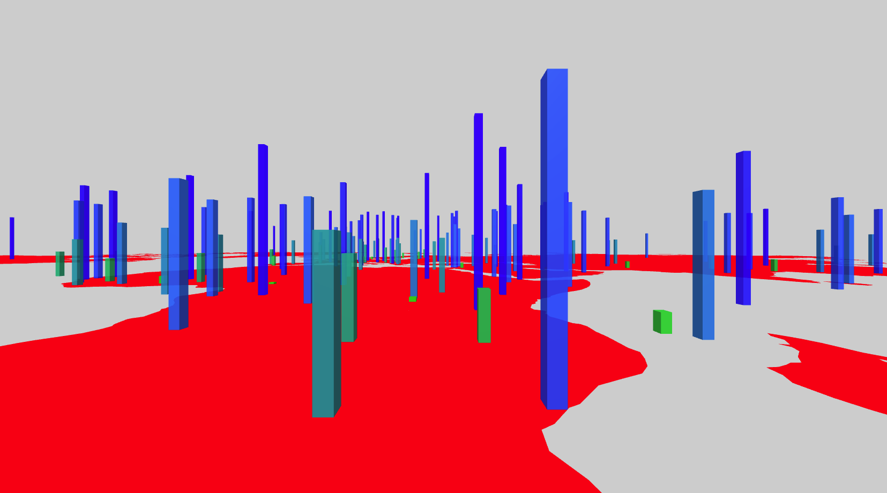

## MapBarChart Component



#### Parameter required in `graph` variable
```
{
  'type': 'MapBarChart',
  'data': {
    'dataFile': "data/mapBarChart.csv",
    'fileType': 'csv',
    'fieldDesc': [['latitude', 'number'], ['longitude', 'number'], ['value', 'number']]
  },
  'style': {
    'origin': [0, 0, 0],
  },
  'mark': {
    'map':{
      'data': mapData,              //GeoJson object of map
      'projection': 'Mercator',     //Possible value: 'Mercator','Robinson','Gall-Peter','Winkel-Tripel','Equirectangular','Natural Earth1'
      'shapeIdentifier':'id',       //Identifier of shapes in GeoJson map data
      'style': {
        'scale': 20,
        'position': [5, 5],
        'rotation': '-90 0 0',
        'opacity': 1,
        'extrusion':{
          'value': 0.0000001,
        },
        'color': {
          'scale':false,
          'fill': 'green',
        },
      },
    },
    'bars':{
      'type': 'box',    //Possible values: 'box','cylinder','cone'
      'style': {
         /*
         
         if the 'type' is 'cylinder'
         'radius': 0.2,
         'segments': 8,
         
         if the 'type' is 'cone'
         'radiusBottom': 0.2,
         'radiusTop': 0,
         'segments': 8,
         
         */
         
         // if the 'type' is 'box'
        'depth': 0.2,
        'width': 0.2,
        'height': {
          'scale': true,
          'scaleType': 'linear',
          'field': 'value',
          'value': [0,5],
        },
        'opacity': 0.4,
        'color': {
          'scale': true,
          'scaleType': 'linear',
          'field': 'value',
          'fill': ['green', 'blue'],
        },
      }
    },
  },
}
```

#### DataFile

**Datafile**: `csv`

The data file must have **latitude**, **longitude** as the header values.

```
latitude,longitude,value
42.546245,1.601554,3.148977637
23.424076,53.847818,9.563725062
33.93911,67.709953,7.260326865
```

#### React Component
```
<MapBarChart 
  data = {d.data}
  style = {d.style}
  mark = {d.mark}
/>
```
