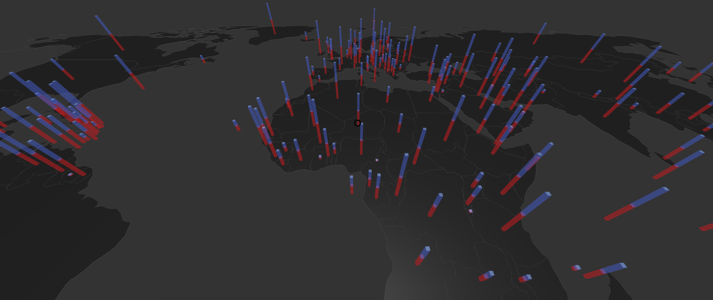

# MapStackedBarChart Component



## `mark` Object in Graph Props
```
'mark': {
  'mapScale': 20,
  'mapOrigin': [5, 5],
  'rotation': '-90 0 0',
  'map': {
    'data': mapData,
    'projection': 'Mercator',
    'shapeIdentifier': 'id',
    'style': {
      'extrusion': {
        'value': 0.0000001,
      },
      'fill': {
        'opacity': 1,
        'color': 'red',
      },
      'stroke': {
        'width': 1,
        'color': 'black',
      },
    },
  },
  'bars': {
    'type': 'box',
    'style': {
      'depth': 0.2,
      'width': 0.2,
      'height': {
        'scaleType': 'linear',
        'field': ['value', 'value1'],
        'value': [0, 5],
      },
      'fill': {
        'opacity': 0.9,
        'scaleType': 'ordinal',
        'color': ['green', 'blue'],
        'field': ['value', 'value1'],
      },
    }
  },
}
```

__Properties for `mark` for Flow Map__

Property|Type|Description
---|---|---
mapScale|int|Defines scale of the map. __Required.__
mapOrigin|array of 2 ints|Defines the origin for the planes. __Required.__ _Format example: [0,0]_
rotation|string|Defines the rotation. __Required.__ _Format example: '-90 0 0'_
map|object|Defines style of the maps. __Required__
map.data|geoJson|Defines the geoJson file that would be used to draw the map. __Required.__
map.projection|string|Defines the projection of the map. __Not Required. Default value: Robinson__ _Available values: Mercator, Robinson, Gall-Peter, Winkel-Tripel, Equirectangular, Natural Earth1._
map.shapeIdentifier|string|Defines the field in the geoJson file of the map which can be used to indentify the different geoJson shapes. __Required.__
map.style|object|Defines the style for the planes. __Required.__
map.style.extrusion|object|Defines the height of the map. __Required.__
map.style.extrusion.value|float|Defines the height of the map. __Required.__ _Value must always be greater that 0. It should be not be 0._
map.style.fill|object|Defines the fill for the planes. __Not Required. If not present the planes are not fill.__
map.style.fill.color|string|Defines the fill color for map. __Required.__
map.style.fill.opacity|float|Defines the opacity of fill of the map. __Required.__
map.style.stroke|object|Defines the stroke for the planes. __Not Required. If not present the planes are not stroked.__
map.style.stroke.width|float|Defines the stroke of the map. __Required.__
map.style.stroke.color|string|Defines the stroke color for map. __Required.__
bars|object|Defines style of the bars. __Required__
bars.type|string|Defines type of bar that would be created. __Not Required. Default value: box__. _Available values: box, cylinder._
bars.style|object|Defines the style for the bar. __Required.__
bars.style.width|float|Defines the width of the bar. __Required if `type` is `box`.__ 
bars.style.depth|float|Defines the depth of the bar.  __Required if `type` is `box`.__ 
bars.style.radius|float|Defines the radius of the bar, if the bar is a cylinder. __Required if `type` is `cylinder`.__ 
bars.style.segments|int|Defines the no. of segments in bar, if the bar is a cylinder or cone. __Required if `type` is `cylinder`.__ 
bars.style.height|object|Defines the height of the bar. __Required.__
bars.style.height.scaleType|string|Defines the scale type for height of the bar. __Required.__ _Available values: linear or ordinal._
bars.style.height.field|string|Defines the field in the data that will be mapped as height of the bar. __Required.__
bars.style.height.domain|array|Defines the domain for height. __Not Required.__ _If not present the domain is calculated from the provide data depending on the bars.style.height.scaleType_
bars.style.height.value|array|Defines the range for height. __Required.__
bars.style.height.startFromZero|boolean|Defines if the domain starts from 0 or not. __Not Required. Default value: false__ _Only applicable if bars.style.height.domain is not given and bars.style.height.scaleType is `linear`._
bars.style.fill|object|Defines the fill of the bar. __Required.__
bars.style.fill.opacity|float|Defines the opacity of the bar. __Required.__ _Value must be between 0 and 1._
bars.style.fill.scaleType|string|Defines the scale type for fill of the bar. __Required.__ _Available values: ordinal._
bars.style.fill.field|array of string|Defines the field in the data that will be mapped as fill of the bar. __Required if `bars.style.fill.scaleType` is present.__
bars.style.fill.color|array| Defines the color for fill. __Not Required if bars.style.fill.scaleType is present, else required. Default value: d3.schemeCategory10__ _If bars.style.fill.scaleType is not present the this needs to be a string otherwise an array._

### [Example JS of the Visualization](../examples/MapStackedBarChart.js)

## Data

**Datafile**: `csv`

The data file must have **latitude**, **longitude** as the header values.

```
latitude,longitude,value,value1
42.546245,1.601554,3.148977637,3.148977637
23.424076,53.847818,9.563725062,9.563725062
33.93911,67.709953,7.260326865,7.260326865
```