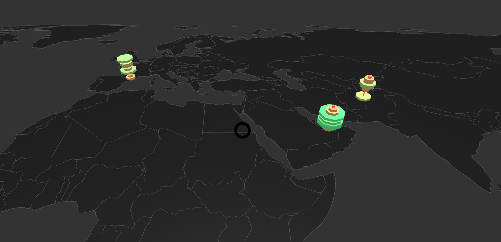

# MapTimeBars Component



## `mark` Object in Graph Props
```
'mark': {
  'mapScale': 20,
  'mapOrigin': [5, 5],
  'rotation': '-45 0 0',
  'map': {
    'data': mapData,
    'projection': 'Mercator',
    'shapeIdentifier': 'id',
    'shapeKey': 'countries',
    'style': {
      'extrusion': {
        'value': 0.0000001,
      },
      'fill': {
        'color': '#111',
        'opacity': 1,
      },
      'stroke': {
        'width': 1,
        'color': '#555',
      },
    },
  },
  'timeLayers': {
    'type': 'cylinder',
    'position': {
      'x': {
        'field': 'longitude',
      },
      'y': {
        'domain': ['2000', '2001', '2002', '2003', '2004', '2005', '2006', '2007', '2008', '2009', '2010'],
      },
      'z': {
        'field': 'latitude',
      }
    },
    'style': {
      'radius': {
        'scaleType': 'linear',
        'value': [0, 1],
        'startFromZero': true,
      },
      'height': 0.2,
      'padding': 0,
      'fill': {
        'opacity': 1,
        'scaleType': 'linear',
        'color': ['#ea4335', '#34a853'],
      },
    }
  },
},
```

__Properties for `mark` for Parametric Time Bars__

Property|Type|Description
---|---|---
mapScale|int|Defines scale of the map. __Required.__
mapOrigin|array of 2 ints|Defines the origin for the planes. __Required.__ _Format example: [0,0]_
rotation|string|Defines the rotation. __Required.__ _Format example: '-90 0 0'_
map|object|Defines style of the maps. __Required__
map.data|geoJson|Defines the geoJson file that would be used to draw the map. __Required.__
map.projection|string|Defines the projection of the map. __Not Required. Default value: Robinson__ _Available values: Mercator, Robinson, Gall-Peter, Winkel-Tripel, Equirectangular, Natural Earth1._
map.shapeIdentifier|string|Defines the field in the geoJson file of the map which can be used to indentify the different geoJson shapes. __Required.__
map.style|object|Defines the style for the planes. __Required.__
map.style.extrusion|object|Defines the height of the map. __Required.__
map.style.extrusion.value|float|Defines the height of the map. __Required.__ _Value must always be greater that 0. It should be not be 0._
map.style.fill|object|Defines the fill for the planes. __Not Required. If not present the planes are not fill.__
map.style.fill.color|string|Defines the fill color for map. __Required.__
map.style.fill.opacity|float|Defines the opacity of fill of the map. __Required.__
map.style.stroke|object|Defines the stroke for the planes. __Not Required. If not present the planes are not stroked.__
map.style.stroke.width|float|Defines the stroke of the map. __Required.__
map.style.stroke.color|string|Defines the stroke color for map. __Required.__
timeLayers|object|Defines the style of the time layers. __Required__
timeLayers.type|string|Defines type of time layer that would be created. __Required. Default value: box__. _Available values: disk, box._
timeLayers.position|object|Defines the how the position of vertices for timelayers will be mapped. __Required__
timeLayers.position.x|object|__Required.__
timeLayers.position.x.field|string|Defines the field in the data that will be the longitude in the data. __Required.__
timeLayers.position.y|object|__Required.__
timeLayers.position.y.domain|array of string|Defines the field in the data that will be mapped as along the height of the map. __Required.__ 
timeLayers.position.z|object|__Required.__
timeLayers.position.z.field|string|Defines the field in the data that will be the latitude in the data. __Required.__
timeLayers.style|object|Defines the style of the timelayers. __Required__
timeLayers.style.height|float|Defines the height of the timelayers. __Required.__
timeLayers.style.padding|float|Defines the spacing between the timelayers. __Required.__
timeLayers.style.radius.scaleType|string|Defines the scale type for radius of the disks. __Required.__ _Available values: linear._
timeLayers.style.radius.domain|array|Defines the domain for radius. __Not Required.__ _If not present the domain is calculated from the provide data depending on the style.radius.scaleType_
timeLayers.style.radius.startFromZero|boolean|Defines if the domain starts from 0 or not. __Not Required. Default value: false__ _Only applicable if style.radius.domain is not given and style.radius.scaleType is `linear`._
timeLayers.style.radius.value|array of float|Defines the radius of the time layers.__Required.__
timeLayers.style.fill|object|Defines the fill of the disks. __Required.__
timeLayers.style.fill.opacity|float|Defines the opacity of the disks. __Required.__ _Value must be between 0 and 1._
timeLayers.style.fill.scaleType|string|Defines the scale type for fill of the disks. __Not Required. If not present then a constant color that is defined is filled in the disks.__ _Available values: linear or ordinal._
timeLayers.style.fill.domain|array|Defines the domain for fill. __Not Required.__ _If not present the domain is calculated from the provide data depending on the timeLayers.style.fill.scaleType_
timeLayers.style.fill.color|array or string|Defines the color for fill. __Not Required if timeLayers.style.fill.scaleType is present, else required. Default value: d3.schemeCategory10__ _If timeLayers.style.fill.scaleType is not present the this needs to be a string otherwise an array._
timeLayers.style.fill.startFromZero|boolean|Defines if the domain starts from 0 or not. __Not Required. Default value: false__ _Only applicable if timeLayers.style.fill.color is not given and timeLayers.style.fill.scaleType is `linear`._
timeLayers.mouseOver|Object|Defines the mouseOver effect on the bars. __Not Required.__ _If not present no mouse over effect happens._
timeLayers.mouseOver.focusedObject|object|Defines the style for the mouseOver effect on the bar. __Required.__
timeLayers.mouseOver.focusedObject.opacity|float|Defines the opacity of bar when mouse hovers on it. __Required.__
timeLayers.mouseOver.focusedObject.fill|string|Defines the color of bar when mouse hovers on it. __Required.__
timeLayers.mouseOver.nonFocusedObject|object|Defines the style for the bar not in focus. __Required.__
timeLayers.mouseOver.nonFocusedObject.opacity|float|Defines the opacity of bar which are not in focus when mouse hovers on a particular bar. __Required.__
timeLayers.mouseOver.label|object|Defines the value and style of the mouse over text. __Not Required.__ _If not present the label is not shown._
timeLayers.mouseOver.label.value|function|Returns the value of the text that is to be shown in the label. __Required.__ _\n can be used for new line._
timeLayers.mouseOver.label.align|string|Defines the alignment of the text in the label. __Required.__ _Available values: center, left or right._
timeLayers.mouseOver.label.fontColor|string|Defines the color of the text in the label. __Required.__
timeLayers.mouseOver.label.lineHeight|float|Defines the line height of the text in the label. __Not Required.__
timeLayers.mouseOver.label.wrapCount|int|Defines the wrap count of the text in the label. __Not Required.__
timeLayers.mouseOver.label.backgroundColor|string|Defines the color of the background of the label. __Required.__
timeLayers.mouseOver.label.backgroundOpacity|string|Defines the color of the background of the label. __Required.__
timeLayers.mouseOver.label.position|string|Defines the position of the label w.r.t the cursor. __Not Required. Format is "0 0 0".__
timeLayers.mouseOver.label.rotation|string|Defines the rotation of the label w.r.t the cursor. __Not Required. Format is "90 0 0".__
timeLayers.mouseOver.label.width|float|Defines the width of the label. __Not Required.__
timeLayers.mouseOver.label.height|float|Defines the height of the label. __Not Required.__

### [Example JS of the Visualization](../examples/MapTimeBars.js)

## Data

**Datafile**: `csv`

```
latitude,longitude,2000,2001,2002,2003,2004,2005,2006,2007,2008,2009,2010
42.546245,1.601554,2.194992,1.160166001,0.032111319,1.560496898,3.762217384,1.899939914,0.235366447,2.645515505,2.953019669,0.644686051,3.657830569
23.424076,53.847818,2.134175074,2.559815541,2.7157409,4.804116084,4.78352727,4.205241398,3.435559479,4.734693285,2.4188434,1.606136125,0.454910996
33.93911,67.709953,3.216622922,0.213578588,0.197809112,0.478974684,1.646816534,1.959324355,3.031906773,3.368299084,1.928245189,2.016923203,0.819164982
17.060816,-61.796428,3.764231013,1.472084125,2.612153586,3.061573625,1.772494121,3.830199151,0.838034332,0.364269871,1.405666114,4.563146406,2.286503306
```
