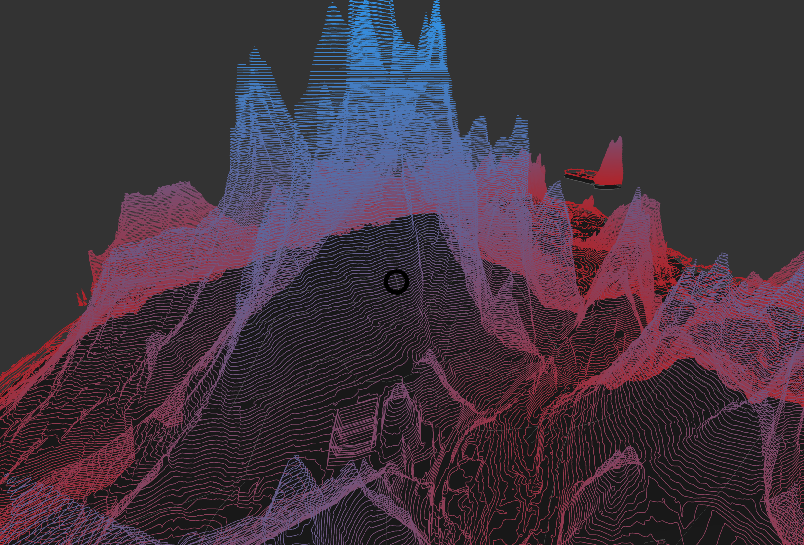

# MapIsoLines Component



## `mark` Object in Graph Props
```
'mark': {
  'mapScale': 2500,
  'mapOrigin': [4978.205, 1862.288],
  'rotation': '-90 0 0',
  'map': {
    'data': sfMapData,
    'projection': 'Mercator',
    'shapeIdentifier': 'id',
    'shapeKey': 'neighbourhood',
    'style': {
      'extrusion': {
        'value': 0.0000001,
      },
      'fill': {
        'opacity': 1,
        'color': 'red',
      },
      'stroke': {
        'width': 1,
        'color': 'black',
      },
    },
  },
  'isoLines': {
    'elevation': {
      'field': 'elevation',
      'value': [0, 2],
    },
    'style': {
      'stroke': {
        'width': 1,
        'scaleType': 'linear',
        'field': 'elevation',
        'color': ['green', 'blue'],
      },
    }
  },
},
```

__Properties for `mark` for Parametric Time Bars__

Property|Type|Description
---|---|---
mapScale|int|Defines scale of the map. __Required.__
mapOrigin|array of 2 ints|Defines the origin for the planes. __Required.__ _Format example: [0,0]_
rotation|string|Defines the rotation. __Required.__ _Format example: '-90 0 0'_
map|object|Defines style of the maps. __Required__
map.data|geoJson|Defines the geoJson file that would be used to draw the map. __Required.__
map.projection|string|Defines the projection of the map. __Not Required. Default value: Robinson__ _Available values: Mercator, Robinson, Gall-Peter, Winkel-Tripel, Equirectangular, Natural Earth1._
map.shapeIdentifier|string|Defines the field in the geoJson file of the map which can be used to indentify the different geoJson shapes. __Required.__
map.style|object|Defines the style for the planes. __Required.__
map.style.extrusion|object|Defines the height of the map. __Required.__
map.style.extrusion.value|float|Defines the height of the map. __Required.__ _Value must always be greater that 0. It should be not be 0._
map.style.fill|object|Defines the fill for the planes. __Not Required. If not present the planes are not fill.__
map.style.fill.color|string|Defines the fill color for map. __Required.__
map.style.fill.opacity|float|Defines the opacity of fill of the map. __Required.__
map.style.stroke|object|Defines the stroke for the planes. __Not Required. If not present the planes are not stroked.__
map.style.stroke.width|float|Defines the stroke of the map. __Required.__
map.style.stroke.color|string|Defines the stroke color for map. __Required.__
isoLines|object|Defines the style and coordinates of the contour lines. __Required.__
isoLines.elevation|object|Defines elevation position of the contour lines. __Required.__
isoLines.elevation.field|string|Defines the field in the data that will be mapped to the elevation position of the contour lines. __Required.__
isoLines.elevation.value|array of float|Defines the range of elevated position of the contour lines. __Required.__
isoLines.style|object|Defines the style of the isoLines. __Required__
isoLines.style.stroke|object|Defines the style of the stroke of the isolines. __Required.__
isoLines.style.stroke.width|float|Defines the stroke width of the isolines. __Required.__
isoLines.style.stroke.scaleType|string|Defines the scale type for stroke colour of the isolines. __Not Required. If not present then a constant color that is used as stroke color.__ _Available values: linear or ordinal._
isoLines.style.stroke.field|string|Defines the field in the data that will be mapped as stroke color. __Required if `style.fill.scaleType` is present.__
isoLines.style.stroke.domain|array|Defines the domain for fill. __Not Required.__ _If not present the domain is calculated from the provide data depending on the isoLines.style.stroke.scaleType_
isoLines.style.stroke.color|array or string|Defines the color for fill. __Not Required if isoLines.style.stroke.scaleType is present, else required. Default value: d3.schemeCategory10__ _If isoLines.style.stroke.scaleType is not present the this needs to be a string otherwise an array._

### [Example JS of the Visualization](../examples/MapTimeBars.js)

## Data

__Data sheet for isoLine must have a column with geoJson of the contour lines.__

**Datafile**: `csv`

```
geojson,objectid,isoline_ty,shape_len,elevation
{"type":"Feature","geometry":{"type":"LineString","coordinates":[[-122.365312222365,37.72557844357855],[-122.36531247137047,37.72561178857835],[-122.36527667842758,37.72567512084703],[-122.36523648966627,37.72570130330321],[-122.36513465017427,37.72573329426379],[-122.36506726971662,37.72574249572528],[-122.36500603714882,37.725741541133026],[-122.36494359632161,37.725722918547085],[-122.36483185688192,37.72566916769388],[-122.3644013412215,37.72542175798813],[-122.36421829470376,37.72531549433387],[-122.36383904994864,37.725090505273165],[-122.36357699065478,37.72493788632751],[-122.363313116381,37.7247874107688],[-122.36308565747979,37.72465484466293],[-122.36268943130707,37.72441979182651],[-122.36244903649843,37.724278529256985],[-122.36217181993372,37.72411293220377],[-122.3620974277381,37.72406441663701],[-122.36220431662323,37.723941426497035],[-122.36237798449129,37.7237576022623],[-122.36241866955906,37.72374020583763],[-122.36247484065115,37.72376535336274],[-122.36267684132467,37.72387588237219],[-122.36310661459711,37.72412619591524],[-122.36351539866311,37.724366927527484],[-122.36375428182313,37.72450571407609],[-122.36404413251702,37.72467162512629],[-122.36456065748058,37.72497338577101],[-122.36511419957532,37.72529457989713],[-122.36521499173688,37.72536283800155],[-122.36527647217254,37.72541883568979],[-122.36530359324537,37.72545925422532],[-122.36531937447646,37.72555044953863],[-122.365312222365,37.72557844357855]]},"properties":{"objectid":1,"isoline_ty":"800 - Normal","shape_len":2405.18476701,"elevation":-25,"index":0}},1,800 - Normal,2405.184767,-25
{"type":"Feature","geometry":{"type":"LineString","coordinates":[[-122.40340866826304,37.70054879885006],[-122.40337792315219,37.700946691939805],[-122.40337395556676,37.701036199594895],[-122.40336066649276,37.701139669077214],[-122.40334713428197,37.7011971352421],[-122.40330152017826,37.70135746885523],[-122.4032827024436,37.70145545819679],[-122.4032611881826,37.70152417541993],[-122.4031813634388,37.70170258600278],[-122.40313952627812,37.70178589285269],[-122.40309518821608,37.701854208142876],[-122.40304993967436,37.70191268184471],[-122.40300978352917,37.70197813353371],[-122.40299295605699,37.702016418514376],[-122.40296650240091,37.70210268900719],[-122.40294957344663,37.70219759298208],[-122.4029332688716,37.70232768143924],[-122.4029182823376,37.702404146626186],[-122.4028885084214,37.702494318741365],[-122.40284928243179,37.70256791264325],[-122.40282094606678,37.702546885813625],[-122.40281327579518,37.702498392175045],[-122.4027925475726,37.702281360080185],[-122.402793220196,37.70220638634336],[-122.40280266288762,37.70206740197877],[-122.40280083353262,37.70200007465283],[-122.40278469369758,37.70194350428442],[-122.40273810361103,37.70183198993022],[-122.40272177451487,37.70171932844088],[-122.40272530842073,37.701591263446105],[-122.40273707444526,37.70145397426264],[-122.40273669168543,37.701290451669834],[-122.40272865976853,37.70121564668755],[-122.40271113312562,37.701149698113575],[-122.40268027617121,37.70110706978725],[-122.40263363544337,37.701097303197706],[-122.40250690682042,37.70113036519736],[-122.40243572868212,37.70114286214266],[-122.40236525833764,37.701135426895114],[-122.40229959183156,37.70110792015907],[-122.40224281652353,37.7010631844251],[-122.4021989560466,37.70100406321902],[-122.40217073261094,37.70093345484349],[-122.40215522335187,37.70085418000424],[-122.40214547476629,37.7006812561976]]},"properties":{"objectid":2,"isoline_ty":"800 - Normal","shape_len":1590.08208442,"elevation":0,"index":1}},2,800 - Normal,1590.082084,0
```
