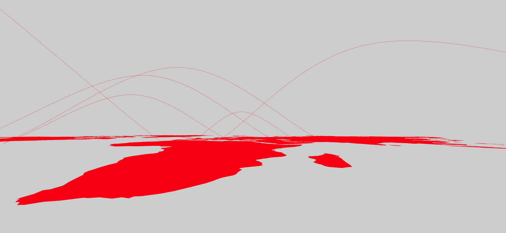

# FlowMap Component



## `mark` Object in Graph Props

```
'mark': {
  'mapScale': 20,
  'mapOrigin': [5, 5],
  'rotation': '-90 0 0',
  'map': {
    'data': mapData,
    'projection': 'Mercator',
    'shapeIdentifier': 'id',
    'style': {
      'extrusion': {
        'value': 0.000001,
      },
      'fill': {
        'color': 'red',
        'opacity': 1,
      },
      'stroke': {
        'width': 1,
        'color': 'black',
      },
    },
  },
  'flowlines': {
    'style': {
      'opacity': {
        'value': 0.4,
      },
      'stroke': {
        'color': 'red',
      },
    },
    'height': {
      'field': 'value',
      'scaleFactor': 1,
    }
  }
}
```

**Properties for `mark` for Flow Map**

| Property                                       | Type                      | Description                                                                                                                                                                                                                                                    |
| ---------------------------------------------- | ------------------------- | -------------------------------------------------------------------------------------------------------------------------------------------------------------------------------------------------------------------------------------------------------------- |
| mapScale                                       | int                       | Defines scale of the map. **Required.**                                                                                                                                                                                                                        |
| mapOrigin                                      | array of 2 ints           | Defines the origin for the planes. **Required.** _Format example: [0,0]_                                                                                                                                                                                       |
| rotation                                       | string                    | Defines the rotation. **Required.** _Format example: '-90 0 0'_                                                                                                                                                                                                |
| map                                            | object                    | Defines style of the maps. **Required**                                                                                                                                                                                                                        |
| map.data                                       | geoJson                   | Defines the geoJson file that would be used to draw the map. **Required.**                                                                                                                                                                                     |
| map.projection                                 | string                    | Defines the projection of the map. **Not Required. Default value: Robinson** _Available values: Mercator, Robinson, Gall-Peter, Winkel-Tripel, Equirectangular, Natural Earth1._                                                                               |
| map.shapeIdentifier                            | string                    | Defines the field in the geoJson file of the map which can be used to indentify the different geoJson shapes. **Required.**                                                                                                                                    |
| map.style                                      | object                    | Defines the style for the planes. **Required.**                                                                                                                                                                                                                |
| map.style.extrusion                            | object                    | Defines the height of the map. **Required.**                                                                                                                                                                                                                   |
| map.style.extrusion.value                      | float                     | Defines the height of the map. **Required.** _Value must always be greater that 0. It should be not be 0._                                                                                                                                                     |
| map.style.fill                                 | object                    | Defines the fill for the planes. **Not Required. If not present the planes are not fill.**                                                                                                                                                                     |
| map.style.fill.color                           | string                    | Defines the fill color for map. **Required.**                                                                                                                                                                                                                  |
| map.style.fill.opacity                         | float                     | Defines the opacity of fill of the map. **Required.**                                                                                                                                                                                                          |
| map.style.stroke                               | object                    | Defines the stroke for the planes. **Not Required. If not present the planes are not stroked.**                                                                                                                                                                |
| map.style.stroke.width                         | float                     | Defines the stroke of the map. **Required.**                                                                                                                                                                                                                   |
| map.style.stroke.color                         | string                    | Defines the stroke color for map. **Required.**                                                                                                                                                                                                                |
| flowlines                                      | object                    | Defines style of the flowlines. **Required**                                                                                                                                                                                                                   |
| flowlines.style                                | object                    | Defines the style for the flowlines. **Required.**                                                                                                                                                                                                             |
| flowlines.style.opacity                        | object                    | Defines the opacity of fill of the map. **Required.**                                                                                                                                                                                                          |
| flowlines.style.opacity.scaleType              | string                    | Defines the scale type for opacity of the flowline. **Not Required. If not present then a constant color that is defined.** _Available values: linear or ordinal._                                                                                             |
| flowlines.style.opacity.field                  | string                    | Defines the field in the data that will be mapped as opacity of the flowline. **Required if `flowlines.style.opacity.scaleType` is present.**                                                                                                                  |
| flowlines.style.opacity.domain                 | array                     | Defines the domain for opacity. **Not Required.** _If not present the domain is calculated from the provide data depending on the flowlines.style.opacity.scaleType_                                                                                           |
| flowlines.style.opacity.startFromZero          | boolean                   | Defines if the domain starts from 0 or not. **Not Required. Default value: false** _Only applicable if flowlines.style.opacity.scaleType is `linear`._                                                                                                         |
| flowlines.style.opacity.value                  | float or array            | Defines the opacity of fill of the map. **Required.** _If flowlines.style.opacity.scaleType is not present the this needs to be a string otherwise an array._                                                                                                  |
| flowlines.style.stroke                         | object                    | Defines the stroke for the flowlines. **Not Required. If not present the flowlines are not stroked.**                                                                                                                                                          |
| flowlines.style.stroke.scaleType               | string                    | Defines the scale type for stroke of the flowline. **Not Required. If not present then a constant color that is defined.** _Available values: linear or ordinal._                                                                                              |
| flowlines.style.stroke.field                   | string                    | Defines the field in the data that will be mapped as stroke of the flowline. **Required if `flowlines.style.stroke.scaleType` is present.**                                                                                                                    |
| flowlines.style.stroke.domain                  | array                     | Defines the domain for fill. **Not Required.** _If not present the domain is calculated from the provide data depending on the flowlines.style.stroke.scaleType_                                                                                               |
| flowlines.style.stroke.color                   | array or string           | Defines the color for fill. **Not Required if flowlines.style.stroke.scaleType is present, else required. Default value: d3.schemeCategory10** _If flowlines.style.stroke.scaleType is not present the this needs to be a string otherwise an array._          |
| flowlines.style.stroke.startFromZero           | boolean                   | Defines if the domain starts from 0 or not. **Not Required. Default value: false** _Only applicable if flowlines.style.stroke.scaleType is `linear`._                                                                                                          |
| flowlines.style.stroke.color                   | string or array of string | Defines the stroke of the flowlines. **Not Required if flowlines.style.stroke.scaleType is present, else required. Default value: d3.schemeCategory10** _If flowlines.style.stroke.scaleType is not present the this needs to be a string otherwise an array._ |
| flowlines.style.stroke.resolution              | number                    | Defines how edgy the curve for the flow is. **Not Required. Default value: 20** _Smaller number is recommended for better performance._                                                                                                                        |
| flowlines.style.stroke.curviness               | number                    | Defines the curve of the flow line. **Not Required. Default value: 0.67** _Must range form 0 to 1._                                                                                                                                                            |
| flowlines.height                               | object                    | Defines the peak height which flowlines can achieve. **Not Required. If not present the height is calculated depending upon the distance between the source and target.**                                                                                      |
| flowlines.height.field                         | string                    | Defines the field in the data that will be mapped as height of the flowlines. **Required.**                                                                                                                                                                    |
| flowlines.height.scaleFactor                   | float                     | Defines the factor with which the height is scaled. **Required.**                                                                                                                                                                                              |
| flowlines.flowAnimation.duration               | object                    | Defines the speed of animation of the dot. **Required.**                                                                                                                                                                                                       |
| flowlines.flowAnimation.duration.scaleType     | string                    | Defines the scale type for duration. **Not Required. If not present then a constant duration that is defined is used.** _Available values: linear._                                                                                                            |
| flowlines.flowAnimation.duration.value         | array of number or number | Defines the value of the duration of animation. **Required** _If flowlines.flowAnimation.duration.scaleType is not present the this needs to be a number otherwise an array._                                                                                  |
| flowlines.flowAnimation.duration.field         | string                    | Defines the field in the data that will be mapped as opacity of the link. **Required if `flowlines.flowAnimation.duration.scaleType` is present.**                                                                                                             |
| flowlines.flowAnimation.duration.domain        | array                     | Defines the domain for opacity. **Not Required.** _If not present the domain is calculated from the provide data depending on the flowlines.flowAnimation.duration.scaleType_                                                                                  |
| flowlines.flowAnimation.duration.startFromZero | boolean                   | Defines if the domain starts from 0 or not. **Not Required. Default value: false**                                                                                                                                                                             |
| flowlines.flowAnimation.radius                 | object                    | Defines the radius of the animating dot. **Required.**                                                                                                                                                                                                         |
| flowlines.flowAnimation.radius.scaleType       | string                    | Defines the scale type for radius. **Not Required. If not present then a constant radius that is defined is used.** _Available values: linear._                                                                                                                |
| flowlines.flowAnimation.radius.value           | array of number or number | Defines the value of the radius. **Required** _If flowlines.flowAnimation.radius.scaleType is not present the this needs to be a number otherwise an array._                                                                                                   |
| flowlines.flowAnimation.radius.field           | string                    | Defines the field in the data that will be mapped as opacity of the link. **Required if `flowlines.flowAnimation.radius.scaleType` is present.**                                                                                                               |
| flowlines.flowAnimation.radius.domain          | array                     | Defines the domain for opacity. **Not Required.** _If not present the domain is calculated from the provide data depending on the flowlines.flowAnimation.radius.scaleType_                                                                                    |
| flowlines.flowAnimation.radius.startFromZero   | boolean                   | Defines if the domain starts from 0 or not. **Not Required. Default value: false**                                                                                                                                                                             |
| nodes                                          | object                    | Defines style of the source and target nodes. **Not Required. If not defined the nodes are not drawn.**                                                                                                                                                        |
| nodes.source                                   | object                    | Defines style of the source nodes. **Not Required. If not defined the source nodes are not drawn.**                                                                                                                                                            |
| nodes.source.type                              | string                    | Defines shape of the source nodes. **Not Required. Default value: sphere**. _Available values: box, sphere._                                                                                                                                                   |
| nodes.source.style                             | object                    | Defines the style of source node. **Required.**                                                                                                                                                                                                                |
| nodes.source.style.radius                      | object                    | Defines the radius or width, depth and height of the node. **Required.**                                                                                                                                                                                       |
| nodes.source.style.radius.value                | float                     | Defines the radius or width, depth and height of the node. **Required.**                                                                                                                                                                                       |
| nodes.source.style.fill                        | object                    | Defines the fill of the source node. **Required.**                                                                                                                                                                                                             |
| nodes.source.style.color                       | string                    | Defines the color of the source node. **Required.**                                                                                                                                                                                                            |
| nodes.source.style.fill.opacity                | float                     | Defines the opacity of the source node. **Required.** _Value must be between 0 and 1._                                                                                                                                                                         |
| nodes.target                                   | object                    | Defines style of the target nodes. **Not Required. If not defined the target nodes are not drawn.**                                                                                                                                                            |
| nodes.target.type                              | string                    | Defines shape of the target nodes. **Not Required. Default value: sphere**. _Available values: box, sphere._                                                                                                                                                   |
| nodes.target.style                             | object                    | Defines the style of target node. **Required.**                                                                                                                                                                                                                |
| nodes.target.style.radius                      | object                    | Defines the radius or width, depth and height of the node. **Required.**                                                                                                                                                                                       |
| nodes.target.style.radius.value                | float                     | Defines the radius or width, depth and height of the node. **Required.**                                                                                                                                                                                       |
| nodes.target.style.fill                        | object                    | Defines the fill of the target node. **Required.**                                                                                                                                                                                                             |
| nodes.target.style.color                       | string                    | Defines the color of the target node. **Required.**                                                                                                                                                                                                            |
| nodes.target.style.fill.opacity                | float                     | Defines the opacity of the target node. **Required.** _Value must be between 0 and 1._                                                                                                                                                                         |

### [Example JS of the Visualization](../examples/Maps/FlowMap.js)

## Data

**Datafile**: `csv`

The data file must have the source and target header values as **source_latitude**,**source_longitude**,**target_latitude**,**target_longitude**.

```
source_latitude,source_longitude,target_latitude,target_longitude,value
42.546245,1.601554,23.424076,53.847818,3.148977637
33.93911,67.709953,17.060816,-61.796428,7.260326865
18.220554,-63.068615,41.153332,20.168331,9.61927466
```

## Known Issue

- Holes in the maps don't work (for example Lesotho in South Africa)
