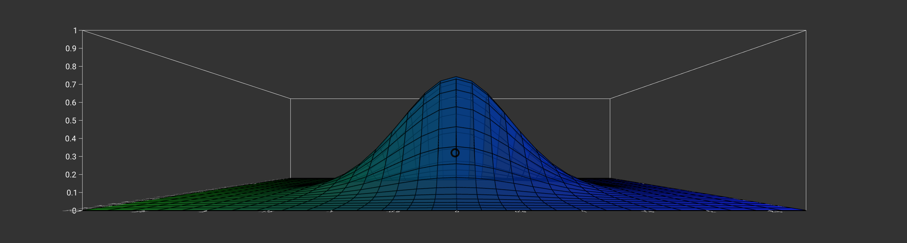

# MeshPlot Component



## `mark` Object in Graph Props
```
'mark': {
  'type': 'plane',
  'position': {
    'x': {
      'scaleType': 'ordinal',
      'field': 'Alpha',
    },
    'y': {
      'scaleType': 'linear',
    },
    'z': {
      'scaleType': 'ordinal',
      'domain': ['-10', '0', '10'],
    }
  },
  'style': {
    'stroke': {
      'color': 'black',
      'width': 2,
    },
    'fill': {
      'scaleType': 'linear',
      'axis': 0,
      'color': ['green', 'blue'],
      'opacity': 0.7,
    },
  }
}
```

__Properties for `mark` for Parametric Mesh Plot__

Property|Type|Description
---|---|---
type|string|Defines type of contour that would be created. __Required. Default value: plane__. _Available values: plane._
position|object|Defines the how the position of vertices for contour will be mapped. __Required__
position.x|object|__Required.__
position.x.scaleType|string|Defines the scale type for x position of the points on the mesh. __Required.__ _Available values: linear or ordinal._
position.x.field|string|Defines the field in the data that will be mapped as x position of the points on the mesh. __Required.__
position.x.domain|float|Defines the domain for x position. __Not Required.__ _If not present the domain is calculated from the provide data depending on the position.x.scaleType._
position.x.startFromZero|boolean|Defines if the domain starts from 0 or not. __Not Required. Default value: false__ _Only applicable if position.x.domain is not given and position.x.scaleType is `linear`._
position.y|object|__Required.__
position.y.scaleType|string|Defines the scale type for y position of the points on the mesh. __Required.__ _Available values: linear or ordinal._
position.y.field|string|Defines the field in the data that will be mapped as y position of the points on the mesh. __Required.__
position.y.domain|float|Defines the domain for y position. __Not Required.__ _If not present the domain is calculated from the provide data depending on the position.y.scaleType._
position.y.startFromZero|boolean|Defines if the domain starts from 0 or not. __Not Required. Default value: false__ _Only applicable if position.y.domain is not given and position.y.scaleType is `linear`._
position.z|object|__Required.__
position.z.scaleType|string|Defines the scale type for z position of the points on the mesh. __Required.__ _Available values: linear or ordinal._
position.z.field|string|Defines the field in the data that will be mapped as z position of the points on the mesh. __Required.__
position.z.domain|float|Defines the domain for z position. __Not Required.__ _If not present the domain is calculated from the provide data depending on the position.z.scaleType._
position.z.startFromZero|boolean|Defines if the domain starts from 0 or not. __Not Required. Default value: false__ _Only applicable if position.z.domain is not given and position.z.scaleType is `linear`._
style|object|Defines the style of the contour. __Required__
style.fill|object|Defines the fill of the surface. __Required.__
style.fill.opacity|float|Defines the opacity of the surface. __Required.__ _Value must be between 0 and 1._
style.fill.scaleType|string|Defines the scale type for fill of the surface. __Not Required. If not present then a constant color that is defined is filled in the surface.__ _Available values: linear._ This is feature to make the mesh more readable.
style.fill.axis|int|Defines along what axis the color will be changed. __Required if `style.fill.scaleType` is present.__ _Availabe values:0, 1, 2. 0 for x-axis, 1 for y-axis and 2 for z-axis._
style.fill.domain|array|Defines the domain for fill. __Not Required.__ _If not present the domain is calculated from the provide data depending on the style.fill.scaleType_
style.fill.color|array or string|Defines the color for fill. __Not Required if style.fill.scaleType is present, else required. Default value: d3.schemeCategory10__ _If style.fill.scaleType is not present the this needs to be a string otherwise an array._
style.stroke|object|Defines the stroke for the mesh. __Not Required. If not present the mesh are not stroked.__ _This can be used to design a mesh to make the mesh more readable._
style.stroke.width|float|Defines the stroke of the mesh.  __Required.__
style.stroke.color|string|Defines the stroke color for  mesh. __Required.__

### [Example JS of the Visualization](../examples/MeshPlot.js)

## Data

**Datafile**: `csv`

```
Alpha,-10,0,10
10,-0.154623,-0.154975,-0.154623
20,-0.159781,-0.159673,-0.159781
30,-0.16475,-0.177522,-0.16475
```
