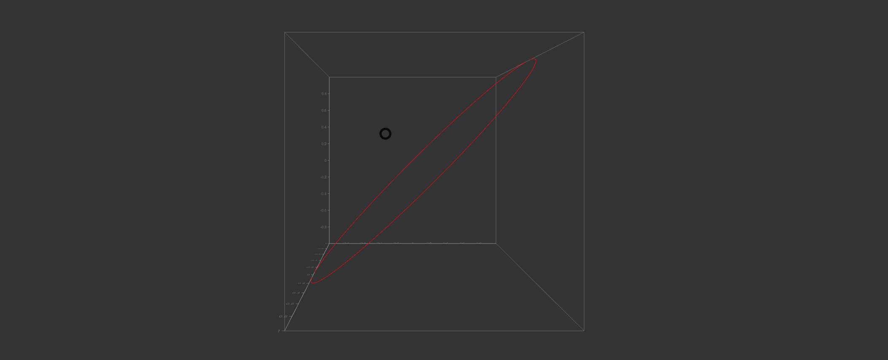

## ParametricCurvePlot Component



#### [Example](../examples/ParametricCurvePlot.js)

#### Parameter required in `graph` variable
```
{
  'type': 'ParametricCurvePlot',
  'style': {
    'origin': [0, 0, 0],
    'dimensions': {
      'width': 10,
      'height': 10,
      'depth': 10,
    },
    'axis-box': true,
    'axis-box-color': 'black',
  },
  'mark': {
    'path':{
      'type': 'line',
      'style': {
        'opacity': 0.4,
        'color': 'red',
      }
    }
  },
  'x': {
    'function': (y) => Math.sin(y),
    'axis': {
      'axis': true,
      'orient': 'bottom-back',
      'title': {
        'text': '',
        'font-size': 10,
        'color': 'black',
        'opacity': 1,
      },
      'ticks': {
        'no-of-ticks': 10,
        'tick-size': 0.1,
        'tick-color': 'black',
        'tick-opacity': 1,
        'grid': true,
        'grid-color': 'black',
        'grid-opacity': 1,
        'font': 'Arial',
        'font-size': 10,
      }
    },
  },
  'y': {
    'function': (y) => Math.sin(y),
    'axis': {
      'axis': true,
      'orient': 'bottom-back',
      'title': {
        'text': '',
        'font-size': 10,
        'color': 'black',
        'opacity': 1,
      },
      'ticks': {
        'no-of-ticks': 10,
        'tick-size': 0.1,
        'tick-color': 'black',
        'tick-opacity': 1,
        'grid': true,
        'grid-color': 'black',
        'grid-opacity': 1,
        'font-size': 10,
      }
    },
  },
  'z': {
    'function': (y) => Math.cos(y),
    'axis': {
      'axis': true,
      'orient': 'bottom-back',
      'title': {
        'text': '',
        'font-size': 10,
        'color': 'black',
        'opacity': 1,
      },
      'ticks': {
        'no-of-ticks': 10,
        'tick-size': 0.1,
        'tick-color': 'black',
        'tick-opacity': 1,
        'grid': true,
        'grid-color': 'black',
        'grid-opacity': 1,
        'font-size': 10,
      }
    },
  },
  'parameter': {
    'domain': [0, 6 * Math.PI],
    'steps': 150,
  }
}
```

#### React Component
```
<ParametricCurvePlot 
  style = {d.style}
  mark = {d.mark}
  x = {d.x}
  y = {d.y}
  z = {d.z}
  parameter = {d.parameter}
/>
```
