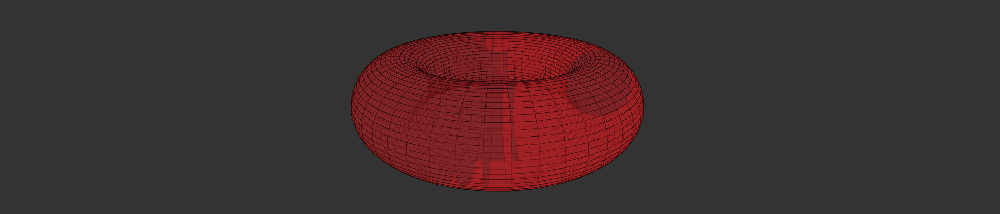

# ParametricSurfacePlot Component



## `mark` Object in Graph Props

```
'mark': {
  'position': {
    'x': {
      'function': (u, v) => Math.cos(u) * (3 + Math.cos(v)),
    },
    'y': {
      'function': (u, v) => Math.sin(v),
    },
    'z': {
      'function': (u, v) => Math.sin(u) * (3 + Math.cos(v)),
    }
  },
  'type': 'plane',
  'style': {
    'fill': {
      'opacity': 0.4,
      'color': 'red',
    },
    'stroke': {
      'width': 1,
      'color': 'black',
    },
  }
}
```

**Properties for `mark` for Parametric Surface Plot**

| Property                 | Type            | Description                                                                                                                                                                                                           |
| ------------------------ | --------------- | --------------------------------------------------------------------------------------------------------------------------------------------------------------------------------------------------------------------- |
| position                 | object          | Defines the how the position of vertices for contour will be mapped. **Required**                                                                                                                                     |
| position.x               | object          | **Required.**                                                                                                                                                                                                         |
| position.x.domain        | array           | Defines the domain for x position. **Not Required.** _If not present the domain is calculated from the provided data depending on the position.x.scaleType._                                                          |
| position.x.startFromZero | boolean         | Defines if the domain starts from 0 or not. **Not Required. Default value: false**. _Only applicable if `position.x.domain` is not given_                                                                             |
| position.x.function      | function        | Defines the function for x position. **Required.**                                                                                                                                                                    |
| position.y               | object          | **Required.**                                                                                                                                                                                                         |
| position.y.domain        | array           | Defines the domain for y position. **Not Required.** _If not present the domain is calculated from the provided data depending on the position.y.scaleType._                                                          |
| position.y.startFromZero | boolean         | Defines if the domain starts from 0 or not. **Not Required. Default value: false**. _Only applicable if `position.y.domain` is not given_                                                                             |
| position.y.function      | function        | Defines the function for y position. **Required.**                                                                                                                                                                    |
| position.z               | object          | **Required.**                                                                                                                                                                                                         |
| position.z.domain        | array           | Defines the domain for z position. **Not Required.** _If not present the domain is calculated from the provided data depending on the position.z.scaleType._                                                          |
| position.z.startFromZero | boolean         | Defines if the domain starts from 0 or not. **Not Required. Default value: false**. _Only applicable if `position.z.domain` is not given_                                                                             |
| position.z.function      | function        | Defines the function for z position. **Required.**                                                                                                                                                                    |
| style                    | object          | Defines the style of the contour. **Not Required**                                                                                                                                                                    |
| style.fill               | object          | Defines the fill of the surface. **Not Required.**                                                                                                                                                                    |
| style.fill.opacity       | float           | Defines the opacity of the surface. **Not Required. Default value: 1** _Value must be between 0 and 1._                                                                                                               |
| style.fill.scaleType     | string          | Defines the scale type for fill of the surface. **Not Required. If not present then a constant color that is defined is filled in the surface.** _Available values: linear or ordinal._                               |
| style.fill.function      | string          | Defines the function that will be mapped as fill of the surface. **Required if `style.fill.scaleType` is present.**                                                                                                   |
| style.fill.domain        | array           | Defines the domain for fill. **Not Required.** _If not present the domain is calculated from the provided data depending on the style.fill.scaleType_                                                                 |
| style.fill.color         | array or string | Defines the color for fill. **Not Required. Default value if style.fill.scaleType is d3.schemeCategory10, else "#ff0000"** _If style.fill.scaleType is not present the this needs to be a string otherwise an array._ |
| style.fill.startFromZero | boolean         | Defines if the domain starts from 0 or not. **Not Required. Default value: false** _Only applicable if style.fill.color is not given and style.fill.scaleType is `linear`._                                           |
| style.stroke             | object          | Defines the stroke for the planes. **Not Required. If not present the planes are not stroked.** _This can be used to design a mesh to make the surface more readable._                                                |
| style.stroke.width       | float           | Defines the stroke of the surface. **Not Required. Default value: 1**                                                                                                                                                 |
| style.stroke.color       | string          | Defines the stroke color for surface. **Not Required. Default value: "#000000"**                                                                                                                                      |

## `parameter` Object in Graph Props (Required)

```
'parameter': {
  'parameter1': {
    'domain': [0, 2 * Math.PI],
    'steps': 50,
  },
  'parameter2': {
    'domain': [0, 2 * Math.PI],
    'steps': 50,
  }
}
```

**Properties for `parameter` for Parametric Curve Plot**

| Property          | Type   | Description                                                           |
| ----------------- | ------ | --------------------------------------------------------------------- |
| parameter1        | object | Defines the setting for the first paramete. **Required.**             |
| parameter1.domain | array  | Defines the domain for which the curve is plot. **Required.**         |
| parameter1.steps  | array  | Defines the intervals at which the curve is calculated. **Required.** |
| parameter2        | object | Defines the setting for the first paramete. **Required.**             |
| parameter2.domain | array  | Defines the domain for which the curve is plot. **Required.**         |
| parameter2.steps  | array  | Defines the intervals at which the curve is calculated. **Required.** |

### [Example JS of the Visualization](../../examples/Plots/ParametricSurfacePlot.js)
