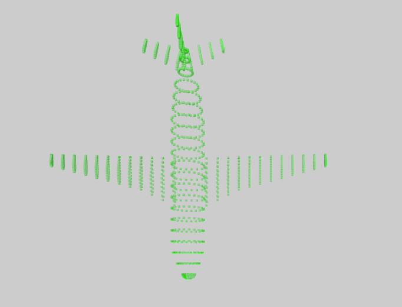

## PointCloud Component



__Note: The `style` object in the graph component has an additional attribute called `objectScale` which is required. It defines the scale on which the point cloud is plotted.__

## `mark` Object in Graph Props
```
'mark': {
  'type': 'box',
  'style': {
    'radius': 0.1,
    'fill': {
      'opacity': 0.4,
      'color': 'green',
    },
  },
}
```

__Properties for `mark` for Stacked Bar Chart__

Property|Type|Description
---|---|---
type|string|Defines type of point that would be created. __Not Required. Default value: sphere__. _Available values: box, sphere._
style|object|Defines the style for the points. __Required.__
style.radius|float|Defines the radius of the points. __Required.__ 
style.fill|object|Defines the fill of the points. __Required.__
style.fill.opacity|float|Defines the opacity of the points. __Required.__ _Value must be between 0 and 1._
style.fill.scaleType|string|Defines the scale type for fill of the points. __Required.__ _Available values: linear, ordinal. Only applicable if file used to plot the point cloud is csv._
style.fill.field|array of string|Defines the field in the data that will be mapped as fill of the bar. __Required if `style.fill.scaleType` is present.__ _Only applicable if file used to plot the point cloud is csv._
style.fill.color|array| Defines the color for fill. __Not Required if style.fill.scaleType is present, else required. Default value: d3.schemeCategory10__ _If style.fill.scaleType is not present the this needs to be a string otherwise an array._
style.fill.startFromZero|boolean|Defines if the domain starts from 0 or not. __Not Required. Default value: false__ _Only applicable if style.fill.domain is not given and style.fill.scaleType is `linear`. Only applicable if file used to plot the point cloud is csv._

### [Example JS of the Visualization](../examples/PointCloud.js)

## Data

**Datafile**: `csv` or `ply`

If the file is csv it must have **x**, **y**, **z** as the header.

```
x,y,z
42.546245,1.601554,3.148977637
23.424076,53.847818,9.563725062
33.93911,67.709953,7.260326865
```