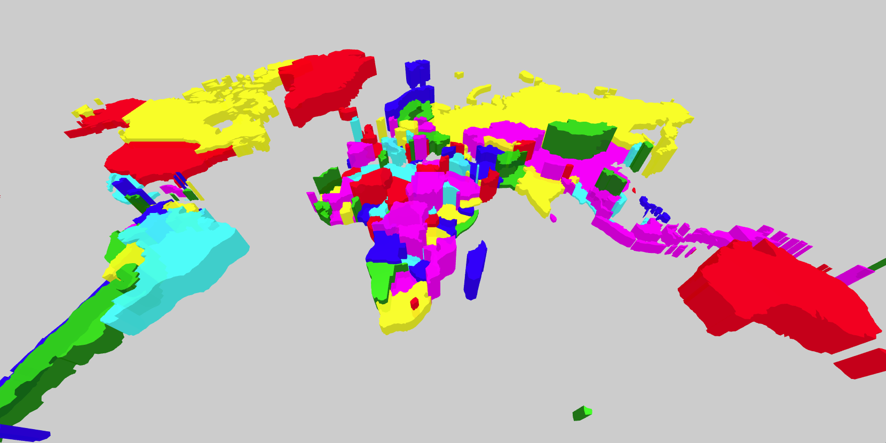

# PrismMap Component



## `mark` Object in Graph Props
```
'mark': {
  'mapScale': 20,
  'mapOrigin': [5, 5],
  'rotation': '-45 0 0',
  'data': mapData,
  'projection': 'Mercator',
  'shapeIdentifier': 'id',
  'style': {
    'extrusion': {
      'scaleType': 'linear',
      'field': 'value',
      'value': [0, 5],
    },
    'fill': {
      'scaleType': 'ordinal',
      'opacity': 0.9,
      'field': 'colorValue',
      'color': ['green', 'blue', 'red', 'yellow', 'magenta', 'cyan'],
    },
    'stroke': {
      'width': 1,
      'color': 'black',
    },
  },
}
```

__Properties for `mark` for Prism Map__

Property|Type|Description
---|---|---
mapScale|int|Defines scale of the map. __Required.__
mapOrigin|array of 2 ints|Defines the origin for the planes. __Required.__ _Format example: [0,0]_
rotation|string|Defines the rotation. __Required.__ _Format example: '-90 0 0'_
data|geoJson|Defines the geoJson file that would be used to draw the map. __Required.__
projection|string|Defines the projection of the map. __Not Required. Default value: Robinson__ _Available values: Mercator, Robinson, Gall-Peter, Winkel-Tripel, Equirectangular, Natural Earth1._
shapeIdentifier|string|Defines the field in the geoJson file of the map which can be used to indentify the different geoJson shapes. The data file must also have a header by the same name so the data can be mapped to the right shape. __Required.__
style|object|Defines the style for the planes. __Required.__
style.extrusion|object|Defines the height of the map. __Required.__
style.extrusion.scaleType|string|Defines the scale type for extrusion of the map shapes. __Required.__ _Available values: linear or ordinal._
style.extrusion.field|string|Defines the field in the data that will be mapped as extrusion of the map shapes. __Required.__
style.extrusion.domain|array|Defines the domain for extrusion. __Not Required.__ _If not present the domain is calculated from the provide data depending on the style.extrusion.scaleType_
style.extrusion.value|array of float|Defines the height of the map. __Required.__
style.fill|object|Defines the fill of the map shapes. __Required.__
style.fill.opacity|float|Defines the opacity of the map shapes. __Required.__ _Value must be between 0 and 1._
style.fill.scaleType|string|Defines the scale type for fill of the map shapes. __Not Required. If not present then a constant color that is defined is filled in the map shapes.__ _Available values: linear or ordinal._
style.fill.field|string|Defines the field in the data that will be mapped as fill of the map shapes. __Required if `style.fill.scaleType` is present.__
style.fill.domain|array|Defines the domain for fill. __Not Required.__ _If not present the domain is calculated from the provide data depending on the style.fill.scaleType_
style.fill.color|array or string|Defines the color for fill. __Not Required if style.fill.scaleType is present, else required. Default value: d3.schemeCategory10__ _If style.fill.scaleType is not present the this needs to be a string otherwise an array._
style.fill.startFromZero|boolean|Defines if the domain starts from 0 or not. __Not Required. Default value: false__ _Only applicable if style.fill.color is not given and style.fill.scaleType is `linear`._
style.stroke|object|Defines the stroke for the planes. __Not Required. If not present the planes are not stroked.__
style.stroke.width|float|Defines the stroke of the map. __Required.__
style.stroke.color|string|Defines the stroke color for map. __Required.__

### [Example JS of the Visualization](../examples/PrismMap.js)

## Data

**Datafile**: `csv`

The data file must have **latitude**, **longitude** as the header values.

```
id,value,colorValue
004,6.769927552817786,1
024,6.860288838552762,5
008,6.492813386791552,3
```