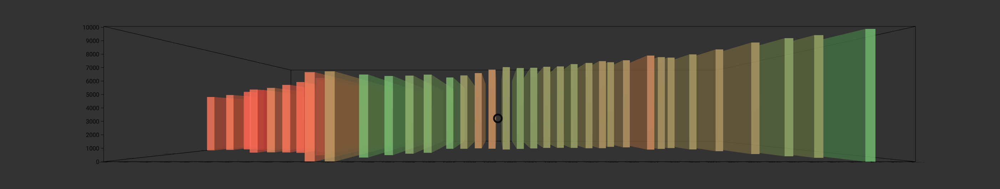

# Rectangle Chart Component



## `mark` Object in Graph Props
```
'mark': {
  'position': {
    'x': {
      'scaleType': 'ordinal',
      'field': 'Year',
    },
  },
  'type': 'box',
  'style': {
    'width': 0.2,
    'depth': {
      'scaleType': 'linear',
      'field': 'Deaths',
    },
    'height': {
      'scaleType': 'linear',
      'field': 'Tornadoes',
    },
    'fill': {
      'opacity': 0.4,
      'scaleType': 'ordinal',
      'field': 'Type',
      'color': ['red', 'green'],
    },
  }
}
```

__Properties for `mark` for Rectangle Chart__

Property|Type|Description
---|---|---
type|string|Defines type of bar that would be created. __Not Required. Default value: box__. _Available values: box._
class|function|Returns the class (html class) for the bars as a function of the data. If space in present then the 2 string with space in between will be taken as different classes. Classes cannot begin with a number and nust not contain any special characters expect _. This can be used for animating or creating interactions with the bars. __Not Required.__
id|function|Returns the id (html id) for the bars as a function of the data. If space in present then the 2 string with space in between will be taken as different id. ids cannot begin with a number and nust not contain any special characters expect _. No 2 ids must be same as id acts as a unique identifier. This can be used for animating or creating interactions with the bars. __not Required.__ 
position|object|Defines the how the position of bars will be mapped. __Required__
position.x|object|__Required.__
position.x.scaleType|float|Defines the scale type for x position of the bar. __Required.__ _Available values: ordinal._
position.x.field|string|Defines the field in the data that will be mapped as x position of the bar. __Required.__
position.x.domain|float|Defines the domain for x position. __Not Required.__ _If not present the domain is calculated from the provide data depending on the position.x.scaleType._
position.x.startFromZero|boolean|Defines if the domain starts from 0 or not. __Not Required. Default value: false__ _Only applicable if position.x.domain is not given and position.x.scaleType is `linear`._
style|object|Defines the style for the bar. __Required.__
style.padding|object|Defines the spacing between the bar. __Required.__ 
style.padding.x|object|Defines the spacing between the bar along x axis. __Required.__ _Value must be between 0 and 1._
style.width|float|Defines the width of the bar. __Required if `type` is `box`.__ 
style.depth|object|Defines the depth of the bar.  __Required if `type` is `box`.__ 
style.depth.scaleType|string|Defines the scale type for depth of the bar. __Required.__ _Available values: linear or ordinal._
style.depth.field|string|Defines the field in the data that will be mapped as depth of the bar. __Required.__
style.depth.domain|array|Defines the domain for depth. __Not Required.__ _If not present the domain is calculated from the provide data depending on the style.depth.scaleType_
style.depth.startFromZero|boolean|Defines if the domain starts from 0 or not. __Not Required. Default value: false__ _Only applicable if style.depth.domain is not given and style.depth.scaleType is `linear`._
style.height|object|Defines the height of the bar. __Required.__
style.height.scaleType|string|Defines the scale type for height of the bar. __Required.__ _Available values: linear or ordinal._
style.height.field|string|Defines the field in the data that will be mapped as height of the bar. __Required.__
style.height.domain|array|Defines the domain for height. __Not Required.__ _If not present the domain is calculated from the provide data depending on the style.height.scaleType_
style.height.startFromZero|boolean|Defines if the domain starts from 0 or not. __Not Required. Default value: false__ _Only applicable if style.height.domain is not given and style.height.scaleType is `linear`._
style.fill|object|Defines the fill of the bar. __Required.__
style.fill.opacity|float|Defines the opacity of the bar. __Required.__ _Value must be between 0 and 1._
style.fill.scaleType|string|Defines the scale type for fill of the bar. __Not Required. If not present then a constant color that is defined is filled in the bar.__ _Available values: linear or ordinal._
style.fill.field|string|Defines the field in the data that will be mapped as fill of the bar. __Required if `style.fill.scaleType` is present.__
style.fill.domain|array|Defines the domain for fill. __Not Required.__ _If not present the domain is calculated from the provide data depending on the style.fill.scaleType_
style.fill.color|array or string|Defines the color for fill. __Not Required if style.fill.scaleType is present, else required. Default value: d3.schemeCategory10__ _If style.fill.scaleType is not present the this needs to be a string otherwise an array._
style.fill.startFromZero|boolean|Defines if the domain starts from 0 or not. __Not Required. Default value: false__ _Only applicable if style.fill.color is not given and style.fill.scaleType is `linear`._
mouseOver|Object|Defines the mouseOver effect on the bars. __Not Required.__ _If not present no mouse over effect happens._
mouseOver.focusedObject|object|Defines the style for the mouseOver effect on the bar. __Required.__
mouseOver.focusedObject.opacity|float|Defines the opacity of bar when mouse hovers on it. __Required.__
mouseOver.focusedObject.fill|string|Defines the color of bar when mouse hovers on it. __Required.__
mouseOver.nonFocusedObject|object|Defines the style for the bar not in focus. __Required.__
mouseOver.nonFocusedObject.opacity|float|Defines the opacity of bar which are not in focus when mouse hovers on a particular bar. __Required.__
mouseOver.label|object|Defines the value and style of the mouse over text. __Not Required.__ _If not present the label is not shown._
mouseOver.label.value|function|Returns the value of the text that is to be shown in the label. __Required.__ _\n can be used for new line._
mouseOver.label.align|string|Defines the alignment of the text in the label. __Required.__ _Available values: center, left or right._
mouseOver.label.fontColor|string|Defines the color of the text in the label. __Required.__
mouseOver.label.lineHeight|float|Defines the line height of the text in the label. __Not Required.__
mouseOver.label.wrapCount|int|Defines the wrap count of the text in the label. __Not Required.__
mouseOver.label.backgroundColor|string|Defines the color of the background of the label. __Required.__
mouseOver.label.backgroundOpacity|string|Defines the color of the background of the label. __Required.__
mouseOver.label.position|string|Defines the position of the label w.r.t the cursor. __Not Required. Format is "0 0 0".__
mouseOver.label.rotation|string|Defines the rotation of the label w.r.t the cursor. __Not Required. Format is "90 0 0".__
mouseOver.label.width|float|Defines the width of the label. __Not Required.__
mouseOver.label.height|float|Defines the height of the label. __Not Required.__

_Note: The width of the bar is calculated depending upon the dimensions of the graph and padding in between the bars._

### [Example JS of the Visualization](../examples/RectangleChart.js)

## Data

**Datafile**: `csv`

```
Year,Tornadoes,Deaths,Type
1996,35,1,1
1997,14,1,2
1998,71,0,1
1999,177,12,2
```
