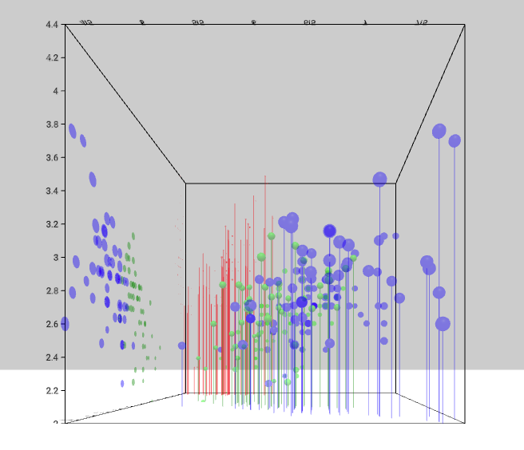

# ScatterPlot Component



## Parameter required in `graph` variable
```
'mark': {
  'position': {
    'x': {
      'scaleType': 'linear',
      'field': 'sepal_length',
    },
    'y': {
      'scaleType': 'linear',
      'field': 'sepal_width',
    },
    'z': {
      'scaleType': 'linear',
      'field': 'petal_length',
    }
  },
  'type': 'sphere',
  'style': {
    'radius': {
      'scaleType': 'linear',
      'field': 'petal_width',
      'value': [0, 0.2],
    },
    'fill': {
      'scaleType': 'ordinal',
      'opacity': 0.4,
      'field': 'species',
      'color': ['red', 'green', 'blue'],
      'domain': ['setosa', 'versicolor', 'virginica'],
    },
  },
  'droplines': {
    'xz': true,
    'yz': false,
    'xy': false,
    'style': {
      'fill': {
        'scaleType': 'ordinal',
        'field': 'species',
        'color': ['red', 'green', 'blue'],
        'opacity': 0.4,
        'domain': ['setosa', 'versicolor', 'virginica'],
      },
    }
  },
  'projections': {
    'xz': false,
    'yz': true,
    'xy': true,
    'style': {
      'fill': {
        'scaleType': 'ordinal',
        'field': 'species',
        'color': ['red', 'green', 'blue'],
        'opacity': 0.4,
        'domain': ['setosa', 'versicolor', 'virginica'],
      },
      'radius': {
        'scaleType': 'linear',
        'field': 'petal_width',
        'value': [0, 0.2],
      },
    }
  }
}
```

__Properties for `mark` for Prism Map__

Property|Type|Description
---|---|---
type|string|Defines type of point that would be created. __Not Required. Default value: sphere__. _Available values: box, sphere._
position|object|Defines the how the position of points will be mapped. __Required.__
position.x|object|__Required.__
position.x.scaleType|string|Defines the scale type for x position of the points. __Required.__ _Available values: linear or ordinal._
position.x.field|string|Defines the field in the data that will be mapped as x position of the points. __Required.__
position.x.domain|float|Defines the domain for x position. __Not Required.__ _If not present the domain is calculated from the provide data depending on the position.x.scaleType._
position.x.startFromZero|boolean|Defines if the domain starts from 0 or not. __Not Required. Default value: false__ _Only applicable if position.x.domain is not given and position.x.scaleType is `linear`._
position.y|object|__Required.__
position.y.scaleType|string|Defines the scale type for y position of the points. __Required.__ _Available values: linear or ordinal._
position.y.field|string|Defines the field in the data that will be mapped as y position of the points. __Required.__
position.y.domain|float|Defines the domain for y position. __Not Required.__ _If not present the domain is calculated from the provide data depending on the position.y.scaleType._
position.y.startFromZero|boolean|Defines if the domain starts from 0 or not. __Not Required. Default value: false__ _Only applicable if position.y.domain is not given and position.x.scaleType is `linear`._
position.z|object|__Required.__
position.z.scaleType|string|Defines the scale type for z position of the points. __Required.__ _Available values: linear or ordinal._
position.z.field|string|Defines the field in the data that will be mapped as z position of the points. __Required.__
position.z.domain|array|Defines the domain for z position. __Not Required.__ _If not present the domain is calculated from the provide data depending on the position.z.scaleType._
position.z.startFromZero|boolean|Defines if the domain starts from 0 or not. __Not Required. Default value: false__ _Only applicable if position.x.domain is not given and position.z.scaleType is `linear`._
style|object|Defines the style for the points. __Required.__
style.radius|object|Defines the radius of the points. __Required.__
style.radius.scaleType|string|Defines the scale type for radius of the points. __Not Required. If not present then a constant radius that is defined is used.__ _Available values: linear or ordinal._
style.radius.field|string|Defines the field in the data that will be mapped as radius of the points. __Required if `style.radius.scaleType` is present.__
style.radius.domain|array|Defines the domain for radius. __Not Required.__ _If not present the domain is calculated from the provide data depending on the style.radius.scaleType_
style.radius.value|array of float or float|Defines the range for radius. __Required.__ _If `style.radius.scaleType` is not present the `style.radius.value` is float or else its an array of float._
style.radius.startFromZero|boolean|Defines if the domain starts from 0 or not. __Not Required. Default value: false__ _Only applicable if style.radius.domain is not given and style.radius.scaleType is `linear`._
style.fill|object|Defines the fill of the points. __Required.__
style.fill.opacity|float|Defines the opacity of the points. __Required.__ _Value must be between 0 and 1._
style.fill.scaleType|string|Defines the scale type for fill of the points. __Not Required. If not present then a constant color that is defined is filled in the points.__ _Available values: linear or ordinal._
style.fill.field|string|Defines the field in the data that will be mapped as fill of the points. __Required if `style.fill.scaleType` is present.__
style.fill.domain|array|Defines the domain for fill. __Not Required.__ _If not present the domain is calculated from the provide data depending on the style.fill.scaleType_
style.fill.color|array or string|Defines the color for fill. __Not Required if style.fill.scaleType is present, else required. Default value: d3.schemeCategory10__ _If style.fill.scaleType is not present the this needs to be a string otherwise an array._
style.fill.startFromZero|boolean|Defines if the domain starts from 0 or not. __Not Required. Default value: false__ _Only applicable if style.fill.color is not given and style.fill.scaleType is `linear`._
droplines|object|Defines the droplines. __Not Required. If not present then a droplines are not drawn.__
droplines.xy|boolean|Defines if the droplines are drawn to the xy plane. __Not Required. Default value: false__ 
droplines.yz|boolean|Defines if the droplines are drawn to the yz plane. __Not Required. Default value: false__ 
droplines.xz|boolean|Defines if the droplines are drawn to the xz plane. __Not Required. Default value: false__ 
droplines.style|object|Defines the style for the droplines. __Required.__
droplines.style.fill|object|Defines the fill of the droplines. __Required.__
droplines.style.fill.opacity|float|Defines the opacity of the droplines. __Required.__ _Value must be between 0 and 1._
droplines.style.fill.scaleType|string|Defines the scale type for fill of the droplines. __Not Required. If not present then a constant color that is defined is filled in the droplines.__ _Available values: linear or ordinal._
droplines.style.fill.field|string|Defines the field in the data that will be mapped as fill of the droplines. __Required if `droplines.style.fill.scaleType` is present.__
droplines.style.fill.domain|array|Defines the domain for fill. __Not Required.__ _If not present the domain is calculated from the provide data depending on the droplines.style.fill.scaleType_
droplines.style.fill.color|array or string|Defines the color for fill. __Not Required if droplines.style.fill.scaleType is present, else required. Default value: d3.schemeCategory10__ _If droplines.style.fill.scaleType is not present the this needs to be a string otherwise an array._
droplines.style.fill.startFromZero|boolean|Defines if the domain starts from 0 or not. __Not Required. Default value: false__ _Only applicable if droplines.style.fill.color is not given and droplines.style.fill.scaleType is `linear`._
projections|object|Defines the projections. __Not Required. If not present then a projections are not drawn.__
projections.xy|boolean|Defines if the projections are drawn to the xy plane. __Not Required. Default value: false__ 
projections.yz|boolean|Defines if the projections are drawn to the yz plane. __Not Required. Default value: false__ 
projections.xz|boolean|Defines if the projections are drawn to the xz plane. __Not Required. Default value: false__ 
projections.style|object|Defines the style for the projection points. __Required.__
projections.style.radius|object|Defines the radius of the projection points. __Required.__
projections.style.radius.scaleType|string|Defines the scale type for radius of the projection points. __Not Required. If not present then a constant radius that is defined is used.__ _Available values: linear or ordinal._
projections.style.radius.field|string|Defines the field in the data that will be mapped as radius of the projection points. __Required if `projections.style.radius.scaleType` is present.__
projections.style.radius.domain|array|Defines the domain for radius. __Not Required.__ _If not present the domain is calculated from the provide data depending on the projections.style.radius.scaleType_
projections.style.radius.value|array|Defines the range for radius. __Not Required.__ _If not present the domain is calculated from the provide data depending on the projections.style.radius.scaleType_
projections.style.radius.startFromZero|boolean|Defines if the domain starts from 0 or not. __Not Required. Default value: false__ _Only applicable if projections.style.radius.domain is not given and projections.style.height.scaleType is `linear`._
projections.style.fill|object|Defines the fill of the projection points. __Required.__
projections.style.fill.opacity|float|Defines the opacity of the projection points. __Required.__ _Value must be between 0 and 1._
projections.style.fill.scaleType|string|Defines the scale type for fill of the projection points. __Not Required. If not present then a constant color that is defined is filled in the projection points.__ _Available values: linear or ordinal._
projections.style.fill.field|string|Defines the field in the data that will be mapped as fill of the projection points. __Required if `projections.style.fill.scaleType` is present.__
projections.style.fill.domain|array|Defines the domain for fill. __Not Required.__ _If not present the domain is calculated from the provide data depending on the projections.style.fill.scaleType_
projections.style.fill.color|array or string|Defines the color for fill. __Not Required if projections.style.fill.scaleType is present, else required. Default value: d3.schemeCategory10__ _If projections.style.fill.scaleType is not present the this needs to be a string otherwise an array._
projections.style.fill.startFromZero|boolean|Defines if the domain starts from 0 or not. __Not Required. Default value: false__ _Only applicable if projections.style.fill.color is not given and projections.style.fill.scaleType is `linear`._

### [Example JS of the Visualization](../examples/ScatterPlot.js)

## Data

**Datafile**: `csv`

```
sepal_length,sepal_width,petal_length,petal_width,species
5.1,3.5,1.4,0.2,setosa
4.9,3.0,1.4,0.2,setosa
4.7,3.2,1.3,0.2,setosa
4.6,3.1,1.5,0.2,setosa
5.0,3.6,1.4,0.2,setosa
5.4,3.9,1.7,0.4,setosa
4.6,3.4,1.4,0.3,setosa
```
