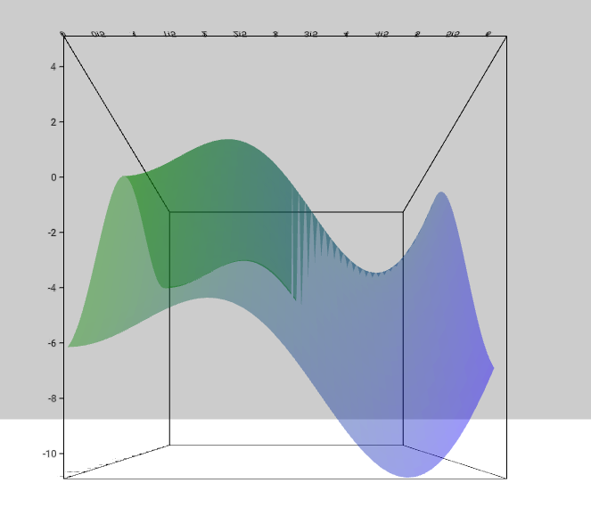

# SurfacePlot Component



## `mark` Object in Graph Props
```
'mark': {
  'type': 'plane',
  'position': {
    'x': {
      'scaleType': 'linear',
      'domain': [0, 2 * Math.PI],
      'steps': 50,
    },
    'y': {
      'scaleType': 'linear',
      'function': (x, z) => x * Math.sin(x) - z * Math.cos(z),
    },
    'z': {
      'scaleType': 'linear',
      'domain': [0, 2 * Math.PI],
      'steps': 50,
    }
  },
  'style': {
    'fill': {
      'scaleType': 'linear',
      'function': (x, z) => x * z,
      'color': ['green', 'blue'],
      'opacity': 1,
    },
    'stroke': {
      'width': 1,
      'color': 'black',
    }
  }
}
```

__Properties for `mark` for Parametric Surface Plot__

Property|Type|Description
---|---|---
type|string|Defines type of contour that would be created. __Required. Default value: plane__. _Available values: plane._
position|object|Defines the how the position of vertices for contour will be mapped. __Required__
position.x|object|__Required.__
position.x.scaleType|string|Defines the scale type for x position. __Required.__ _Available values: linear._
position.x.domain|array|Defines the domain for x position. __Not Required.__ _If not present the domain is calculated from the provide data depending on the position.x.scaleType._
position.x.steps|array|Defines the intervals at which the curve is calculated. __Required.__
position.y|object|__Required.__
position.y.scaleType|string|Defines the scale type for y position. __Required.__ _Available values: linear._
position.y.domain|array|Defines the domain for y position. __Not Required.__ _If not present the domain is calculated from the provide data depending on the position.y.scaleType._
position.y.function|function|Defines the function for y position. __Required.__
position.z|object|__Required.__
position.z.scaleType|string|Defines the scale type for z position. __Required.__ _Available values: linear._
position.z.domain|array|Defines the domain for z position. __Required.__ _If not present the domain is calculated from the provide data depending on the position.z.scaleType._
position.z.steps|array|Defines the intervals at which the curve is calculated. __Required.__
style|object|Defines the style of the contour. __Required__
style.fill|object|Defines the fill of the surface. __Not Required. If not present the planes are not fill.__
style.fill.opacity|float|Defines the opacity of the surface. __Required.__ _Value must be between 0 and 1._
style.fill.scaleType|string|Defines the scale type for fill of the surface. __Not Required. If not present then a constant color that is defined is filled in the surface.__ _Available values: linear or ordinal._
style.fill.function|string|Defines the function that will be mapped as fill of the surface. __Required if `style.fill.scaleType` is present.__
style.fill.domain|array|Defines the domain for fill. __Not Required.__ _If not present the domain is calculated from the provide data depending on the style.fill.scaleType_
style.fill.color|array or string|Defines the color for fill. __Not Required if style.fill.scaleType is present, else required. Default value: d3.schemeCategory10__ _If style.fill.scaleType is not present the this needs to be a string otherwise an array._
style.fill.startFromZero|boolean|Defines if the domain starts from 0 or not. __Not Required. Default value: false__ _Only applicable if style.fill.color is not given and style.fill.scaleType is `linear`._
style.stroke|object|Defines the stroke for the planes. __Not Required. If not present the planes are not stroked.__ _This can be used to design a mesh to make the surface more readable._
style.stroke.width|float|Defines the stroke of the surface.  __Required.__
style.stroke.color|string|Defines the stroke color for  surface. __Required.__

### [Example JS of the Visualization](../examples/SurfacePlot.js)
