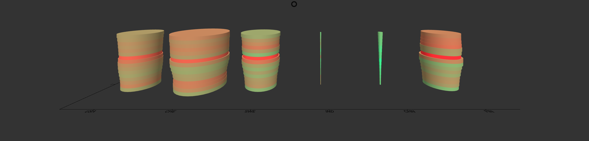

# TimeBars Component



## `mark` Object in Graph Props
```
'mark': {
  'type': 'disks',
  'position': {
    'x': {
      'scaleType': 'ordinal',
      'field': 'City',
    },
    'y': {
      'scaleType': 'linear',
      'field': 'Years',
      'format': 'YYYY',
    },
    'z': {
      'scaleType': 'ordinal',
      'field': 'Month',
    }
  },
  'style': {
    'padding': {
      'x': 0.1,
      'z': 0.1,
    },
    'radius': {
      'field': 'Years',
      'scaleType': 'linear',
    },
    'fill': {
      'field': 'Color',
      'opacity': 1,
      'scaleType': 'ordinal',
      'color': ['yellow', 'green'],
    },
  }
}
```

__Properties for `mark` for Parametric Time Bars__

Property|Type|Description
---|---|---
type|string|Defines type of contour that would be created. __Required. Default value: disk__. _Available values: disk, box. (box is currently unavailable)_
position|object|Defines the how the position of vertices for contour will be mapped. __Required__
position.x|object|__Required.__
position.x.scaleType|string|Defines the scale type for x position of the disks in time bars. __Required.__ _Available values: ordinal._
position.x.field|string|Defines the field in the data that will be mapped as x position of the disks in time bars. __Required.__
position.x.domain|float|Defines the domain for x position. __Not Required.__ _If not present the domain is calculated from the provide data depending on the position.x.scaleType._
position.x.startFromZero|boolean|Defines if the domain starts from 0 or not. __Not Required. Default value: false__ _Only applicable if position.x.domain is not given and position.x.scaleType is `linear`._
position.y|object|__Required.__
position.y.scaleType|string|Defines the scale type for y position of the disks in time bars. __Required.__ _Available values: linear or ordinal._
position.y.field|string|Defines the field in the data that will be mapped as y position of the disks in time bars. __Required.__
position.y.domain|float|Defines the domain for y position. __Not Required.__ _If not present the domain is calculated from the provide data depending on the position.y.scaleType._
position.y.format|string|Defines the format in which the ticks are created. __Required.__
position.z|object|__Required.__
position.z.scaleType|string|Defines the scale type for z position of the disks in time bars. __Required.__ _Available values: ordinal._
position.z.field|string|Defines the field in the data that will be mapped as z position of the disks in time bars. __Required.__
position.z.domain|float|Defines the domain for z position. __Not Required.__ _If not present the domain is calculated from the provide data depending on the position.z.scaleType._
position.z.startFromZero|boolean|Defines if the domain starts from 0 or not. __Not Required. Default value: false__ _Only applicable if position.z.domain is not given and position.z.scaleType is `linear`._
style|object|Defines the style of the contour. __Required__
style.height|float|Defines the height of the disks. __Not Required. If not defined the height of the disks is calculated automatically and it depends on the height of the visualization defined in `style` prop and the no. of disks there are.__
style.padding|object|Defines the spacing between the largest radius disks. __Required.__ 
style.padding.x|object|Defines the spacing between the largest radius disks along x axis. __Required.__ _Value must be between 0 and 1. These values are used to determine the range of the disks._
style.padding.z|object|Defines the spacing between the largest radius disks along z axis. __Required.__ _Value must be between 0 and 1. These values are used to determine the range of the disks._
style.radius.scaleType|string|Defines the scale type for radius of the disks. __Not Required. If not present then a constant radius that is defined is used.__ _Available values: linear or ordinal._
style.radius.field|string|Defines the field in the data that will be mapped as radius of the disks. __Required if `style.radius.scaleType` is present.__
style.radius.domain|array|Defines the domain for radius. __Not Required.__ _If not present the domain is calculated from the provide data depending on the style.radius.scaleType_
style.radius.startFromZero|boolean|Defines if the domain starts from 0 or not. __Not Required. Default value: false__ _Only applicable if style.radius.domain is not given and style.radius.scaleType is `linear`._
style.fill|object|Defines the fill of the disks. __Required.__
style.fill.opacity|float|Defines the opacity of the disks. __Required.__ _Value must be between 0 and 1._
style.fill.scaleType|string|Defines the scale type for fill of the disks. __Not Required. If not present then a constant color that is defined is filled in the disks.__ _Available values: linear or ordinal._
style.fill.field|string|Defines the field in the data that will be mapped as fill of the disks. __Required if `style.fill.scaleType` is present.__
style.fill.domain|array|Defines the domain for fill. __Not Required.__ _If not present the domain is calculated from the provide data depending on the style.fill.scaleType_
style.fill.color|array or string|Defines the color for fill. __Not Required if style.fill.scaleType is present, else required. Default value: d3.schemeCategory10__ _If style.fill.scaleType is not present the this needs to be a string otherwise an array._
style.fill.startFromZero|boolean|Defines if the domain starts from 0 or not. __Not Required. Default value: false__ _Only applicable if style.fill.color is not given and style.fill.scaleType is `linear`._

_Note: The range of radius of the disk is calculated depending upon the dimensions of the graph and padding in between the disks._

### [Example JS of the Visualization](../examples/TimeBars.js)

## Data

**Datafile**: `json`

```
[
  {
    "City": "Myriel",
    "Month": 1,
    "Years": {
      "1998": 1,
      "1999": 2,
      "2000": 3,
      "2001": 4,
      "2002": 5,
      "2003": 6
    },
    "Color": {
      "1998": 1,
      "1999": 2,
      "2000": 1,
      "2001": 2,
      "2002": 1,
      "2003": 2
    }
  },
  {
    "City": "Napoleon",
    "Month": 1,
    "Years": {
      "1998": 1,
      "1999": 2,
      "2000": 3,
      "2001": 4,
      "2002": 5,
      "2003": 6
    },
    "Color": {
      "1998": 1,
      "1999": 2,
      "2000": 1,
      "2001": 2,
      "2002": 1,
      "2003": 2
    }
  }
]
```
